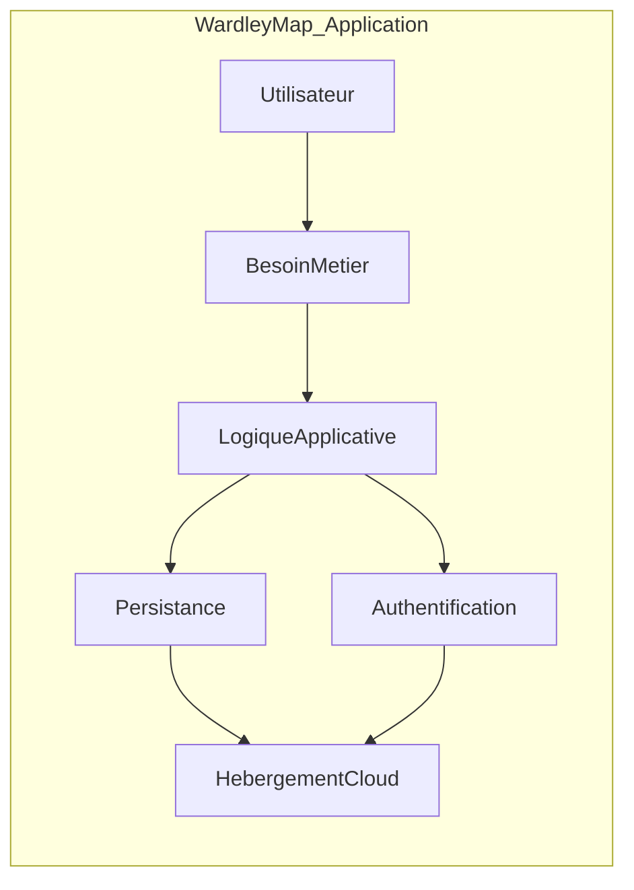
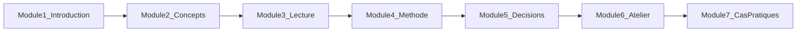

# Module 1 — Introduction

**Durée estimée :** 30 minutes

## Objectifs

À la fin de ce module, vous saurez :

- Pourquoi les outils de stratégie classiques sont insuffisants pour les choix technologiques
- Ce qu'est une Wardley Map et ce qu'elle apporte
- Ce que vous allez produire à l'issue du cours

## Le problème : « Quelle techno choisir ? »

Face à un nouveau projet ou une refonte, les équipes techniques se posent souvent ces questions :

- React ou Vue ? PostgreSQL ou MongoDB ?
- Construire notre propre système d'authentification ou utiliser Auth0 ?
- Héberger sur AWS, GCP, ou un VPS simple ?
- Faire appel à une équipe externe pour le frontend ?

Ces questions sont pertinentes, mais elles arrivent **trop tôt** et **au mauvais niveau**. Elles portent sur des **implémentations** (des technologies) alors que la vraie question stratégique est : **où créer de la valeur, et où utiliser ce qui existe déjà ?**

### Limites des outils classiques

| Outil | Ce qu'il fait bien | Ce qu'il ne fait pas |
|-------|-------------------|----------------------|
| **SWOT** | Identifier forces/faiblesses internes et opportunités/menaces externes | Visualiser les dépendances entre composants ni leur évolution |
| **5 forces de Porter** | Analyser la concurrence sectorielle | Guider un choix build vs buy pour un composant technique |
| **Matrice impact/effort** | Prioriser un backlog de features | Situer un composant dans son cycle de maturité marché |
| **Diagrammes d'architecture** | Documenter l'état actuel du système | Anticiper ce qui va se commoditiser |

Aucun de ces outils ne répond à la question : **« Ce composant va-t-il devenir une commodité ? Devons-nous investir dedans ou l'acheter ? »**

## La Wardley Map : une carte du paysage

Une **Wardley Map** (carte de Wardley) est une technique de visualisation stratégique créée par **Simon Wardley** vers 2005. Elle combine trois éléments :

1. **La chaîne de valeur** — du besoin utilisateur jusqu'à l'infrastructure
2. **L'évolution** — chaque composant progresse de « nouveau et incertain » vers « standard et commoditisé »
3. **Les dépendances** — les liens entre composants

Sur une vraie Wardley Map, chaque composant est aussi positionné horizontalement selon son stade d'évolution (Genesis → Commodity). Nous verrons cela en détail au module 2.

## La promesse de ce cours

Ce cours vous fera passer de :

> « Quelle technologie dois-je choisir ? »

à :

> « Où dois-je me différencier, et quels composants dois-je acheter ou externaliser ? »

Concrètement, vous apprendrez à :

1. **Cartographier** votre application (composants, besoins, dépendances)
2. **Lire** les zones stratégiques de la map (innovation, arbitrage, commodité)
3. **Décider** rationnellement : construire, acheter (SaaS), externaliser (prestataire), ou ne pas investir
4. **Anticiper** la commoditisation pour éviter de construire ce qui deviendra gratuit demain

## Vue d'ensemble du parcours

| Module | Contenu |
|--------|---------|
| 1 — Introduction | Pourquoi et quoi (ce module) |
| 2 — Concepts | Utilisateur, besoins, composants, axes, évolution |
| 3 — Lecture | Déchiffrer une map existante |
| 4 — Méthode | Construire sa propre map en 7 étapes |
| 5 — Décisions | Build / buy / outsource avec grille de critères |
| 6 — Atelier | Appliquer sur **votre** application |
| 7 — Cas pratiques | 3 études de cas commentées |

## Livrables attendus

À l'issue du cours, vous aurez :

- Une **Wardley Map** de votre application
- Un **tableau de décisions** pour chaque composant stratégique
- Un **plan d'action** avec 3 décisions prioritaires

## Résumé

- Les choix technologiques ne doivent pas se faire au hasard ou par habitude
- Une Wardley Map visualise la chaîne de valeur, l'évolution et les dépendances
- L'objectif est la **prise de conscience situationnelle** (*situational awareness*) pour décider où investir et où s'appuyer sur l'existant

## Suite

→ [Module 2 — Concepts fondamentaux](02-concepts-fondamentaux.md)
