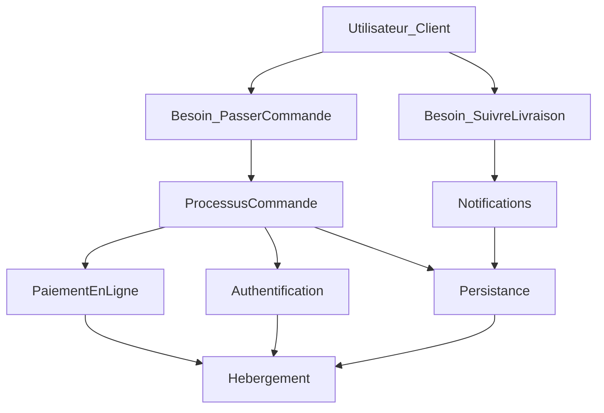
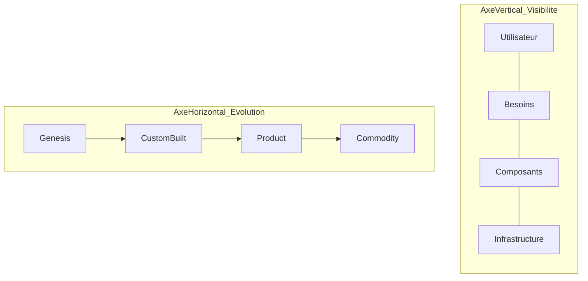

# Module 2 — Concepts fondamentaux

**Durée estimée :** 45 minutes

## Objectifs

À la fin de ce module, vous saurez :

- Identifier les trois types d'éléments d'une map : utilisateur, besoins, composants
- Comprendre les deux axes : chaîne de valeur (vertical) et évolution (horizontal)
- Lire les quatre stades d'évolution et le concept de mouvement

## Les trois types d'éléments

Une Wardley Map ne cartographie pas des technologies directement. Elle cartographie des **éléments de valeur**.

### 1. L'utilisateur (ou l'acteur)

C'est la personne ou l'organisation qui **reçoit la valeur** de votre application.

Exemples pour une application informatique :

- Un client e-commerce qui passe commande
- Un administrateur qui gère les utilisateurs
- Un développeur qui intègre votre API
- Une équipe interne qui utilise un outil de reporting

**Règle :** il y a souvent **un utilisateur principal** par map. Si vous avez plusieurs personas très différents, créez plusieurs maps.

### 2. Les besoins

Ce sont les **tâches ou objectifs** que l'utilisateur veut accomplir. Ce ne sont pas des features techniques.

| Feature (à éviter) | Besoin (correct) |
|--------------------|------------------|
| « API REST » | « Accéder à mes données depuis un autre système » |
| « Dashboard React » | « Visualiser l'état de mon activité en temps réel » |
| « Base PostgreSQL » | « Conserver l'historique de mes transactions » |
| « Microservices » | « Payer en ligne de manière sécurisée » |

Les besoins se placent **juste sous l'utilisateur**, en haut de la chaîne de valeur.

### 3. Les composants (capacités)

Ce sont les **éléments nécessaires** pour satisfaire un besoin. Un composant peut être :

- Une capacité métier (moteur de recommandation, calcul de tarification)
- Une capacité technique (authentification, persistance, envoi d'emails)
- Une infrastructure (hébergement, réseau, CDN)

**Important :** un composant est un **quoi**, pas un **comment**. « Persistance des données » est un composant ; « PostgreSQL » est une implémentation.

## Les deux axes

### Axe vertical : la chaîne de valeur

Du **haut** (utilisateur) vers le **bas** (infrastructure) :

```text
┌─────────────────────────────────────┐
│  Utilisateur                        │  ← Très visible
├─────────────────────────────────────┤
│  Besoins utilisateur                │  ← Visible
├─────────────────────────────────────┤
│  Capacités métier / applicatives    │  ← Partiellement visible
├─────────────────────────────────────┤
│  Services techniques                │  ← Peu visible
├─────────────────────────────────────┤
│  Infrastructure                     │  ← Invisible pour l'utilisateur
└─────────────────────────────────────┘
```

Plus un composant est **haut** sur la map, plus il est **visible** pour l'utilisateur final. Plus il est **bas**, plus il est **abstrait** et caché.

### Axe horizontal : l'évolution

De **gauche** (nouveau) vers **droite** (commoditisé) :

```text
Genesis          Custom-built       Product           Commodity
(nouveau)        (sur mesure)         (produit)         (utilitaire)
    │                │                  │                  │
    ▼                ▼                  ▼                  ▼
 Incertain      Spécialisé          Standardisé       Ubiquitaire
 Unique         Différenciant         Packagé           Interchangeable
 Risqué         Coûteux              Stable            Bon marché
```

#### Les quatre stades en détail

| Stade | Description | Exemples (2025) |
|-------|-------------|-----------------|
| **Genesis** | Nouveau, peu compris, unique, expérimental | IA générative appliquée à un cas métier très spécifique |
| **Custom-built** | Compris mais nécessite une expertise sur mesure | Pipeline ETL custom, moteur de règles métier propriétaire |
| **Product** | Disponible comme produit ou service packagé | Auth0, Stripe, Elasticsearch managé |
| **Commodity** | Standard universel, interchangeable, utilitaire | Hébergement cloud, DNS, certificats TLS, envoi SMTP |

### Les zones stratégiques

```text
                    Genesis    Custom    Product    Commodity
                 ┌──────────┬─────────┬─────────┬──────────┐
    Utilisateur  │          │         │         │          │
                 ├──────────┼─────────┼─────────┼──────────┤
    Besoins      │ INNOVER  │         │         │          │
                 ├──────────┼─────────┼─────────┼──────────┤
    Métier       │ ★ Diff.  │ Arbitr. │         │          │
                 ├──────────┼─────────┼─────────┼──────────┤
    Technique    │          │ Arbitr. │ Acheter │ ACHETER  │
                 ├──────────┼─────────┼─────────┼──────────┤
    Infra        │          │         │         │ ★ Comm.  │
                 └──────────┴─────────┴─────────┴──────────┘
```

- **Haut-gauche** : zone d'innovation et de différenciation → construire
- **Bas-droite** : zone de commodité → acheter, ne pas réinventer
- **Milieu** : zone d'arbitrage → analyser au cas par cas

## Les dépendances

Les composants sont reliés par des **flèches** qui indiquent « A a besoin de B pour fonctionner ».



**Règle :** les flèches vont du haut vers le bas (du besoin vers ce qui le soutient).

## Le mouvement

Tout composant **évolue vers la droite** avec le temps. C'est le principe fondamental des Wardley Maps.

Exemples historiques :

| Composant | Il y a 15 ans | Aujourd'hui |
|-----------|---------------|-------------|
| Hébergement web | Custom-built (serveur dédié) | Commodity (cloud) |
| Authentification | Custom-built (session maison) | Product (Auth0, Firebase Auth) |
| Paiement en ligne | Custom-built (intégration bancaire) | Product (Stripe, PayPal) |
| CDN | Product (Akamai) | Commodity (Cloudflare) |
| IA générative | Genesis | Custom-built / Product (en transition) |

Sur la map, on représente le mouvement anticipé par des **flèches horizontales** pointant vers la droite.

**Implication stratégique :** si vous construisez aujourd'hui un composant qui sera une commodité dans 2 ans, vous gaspillez des ressources.

## Diagramme de synthèse



## Application à une app informatique : exemple rapide

Prenons une application de **gestion de réservations** pour des hôtels :

| Élément | Type | Position verticale | Position horizontale |
|---------|------|-------------------|---------------------|
| Gérant d'hôtel | Utilisateur | Sommet | — |
| « Optimiser le taux d'occupation » | Besoin | Haut | — |
| « Gérer les réservations » | Besoin | Haut | — |
| Algorithme de yield management | Composant | Milieu | Genesis/Custom |
| Calendrier de disponibilités | Composant | Milieu | Product |
| Authentification | Composant | Bas | Product |
| Base de données | Composant | Bas | Commodity |
| Hébergement cloud | Composant | Bas | Commodity |

L'algorithme de yield management est en haut-gauche : c'est là que l'hôtel se différencie. L'hébergement est en bas-droite : on achète, point final.

## Résumé

- Une map contient des **utilisateurs**, des **besoins** et des **composants** — pas des technologies
- L'axe **vertical** mesure la visibilité (utilisateur en haut, infra en bas)
- L'axe **horizontal** mesure l'évolution (genesis à gauche, commodity à droite)
- Les **dépendances** relient les composants du haut vers le bas
- Tout **évolue vers la droite** : anticipez la commoditisation

## Suite

→ [Module 3 — Lire une Wardley Map](03-lecture-d-une-map.md)
