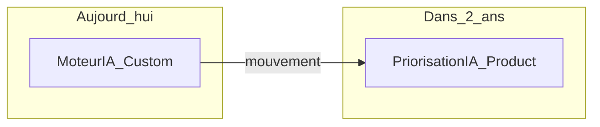

# Module 3 — Lire une Wardley Map

**Durée estimée :** 45 minutes

## Objectifs

À la fin de ce module, vous saurez :

- Déchiffrer une Wardley Map d'application SaaS commentée
- Identifier les zones stratégiques et en déduire des orientations
- Repérer les signaux de mouvement et les risques

## Exercice associé

→ [Exercice 1 — Lire une map](exercices/ex01-lire-une-map.md)

## Exemple commenté : plateforme SaaS de gestion de projets

Imaginons **TaskFlow**, une application SaaS qui aide les équipes à gérer leurs projets. Voici sa Wardley Map :

```text
                    Genesis    Custom      Product      Commodity
                 ┌──────────┬───────────┬────────────┬────────────┐
                 │          │           │            │            │
  Utilisateur    │  [Chef   │           │            │            │
  (Chef de       │  de      │           │            │            │
   projet]       │  projet] │           │            │            │
                 │          │           │            │            │
                 ├──────────┼───────────┼────────────┼────────────┤
                 │          │           │            │            │
  Besoins        │          │[Planifier │[Collaborer│            │
                 │          │ le projet]│ en équipe] │            │
                 │          │           │            │            │
                 ├──────────┼───────────┼────────────┼────────────┤
                 │          │           │            │            │
  Métier         │          │[Moteur de │[Gestion   │            │
                 │          │ priorisa- │ des tâches│            │
                 │          │ tion IA]  │]           │            │
                 │          │     →     │            │            │
                 ├──────────┼───────────┼────────────┼────────────┤
                 │          │           │            │            │
  Technique      │          │[API      │[Auth]      │[Envoi      │
                 │          │ publique] │            │ email]     │
                 │          │           │            │            │
                 ├──────────┼───────────┼────────────┼────────────┤
                 │          │           │            │            │
  Infra          │          │           │[BDD       │[Hébergement│
                 │          │           │ managée]   │ cloud]     │
                 │          │           │            │[CDN]       │
                 └──────────┴───────────┴────────────┴────────────┘
```

### Lecture couche par couche

#### Utilisateur (sommet)

Le **chef de projet** est l'acteur principal. Toute la map est orientée vers ses besoins. Si TaskFlow ciblait aussi des développeurs (intégration API), on ajouterait un second utilisateur ou une seconde map.

#### Besoins (haut de la chaîne de valeur)

| Besoin | Position | Interprétation |
|--------|----------|----------------|
| Planifier le projet | Custom | Encore différenciant — chaque outil propose sa vision |
| Collaborer en équipe | Product | Fonctionnalité standard, attendue par tous les outils du marché |

#### Composants métier (milieu)

| Composant | Position | Interprétation |
|-----------|----------|----------------|
| Moteur de priorisation IA | Custom, mouvement → Product | Avantage compétitif actuel, mais l'IA va se standardiser. TaskFlow doit capitaliser maintenant et préparer la transition |
| Gestion des tâches | Product | Commodité fonctionnelle — ne pas sur-investir, mais doit être fiable |

#### Composants techniques (bas)

| Composant | Position | Interprétation |
|-----------|----------|----------------|
| API publique | Custom | Encore en développement, positionnement à définir |
| Authentification | Product | Utiliser Auth0 ou équivalent — ne pas construire |
| Envoi d'emails | Commodity | SendGrid, AWS SES — utilitaire pur |

#### Infrastructure (fond)

| Composant | Position | Interprétation |
|-----------|----------|----------------|
| BDD managée | Product | RDS, Supabase — choisir et ne pas opérer soi-même |
| Hébergement cloud | Commodity | AWS/GCP/Azure — interchangeable |
| CDN | Commodity | Cloudflare — standard |

## Les zones stratégiques en action

### Zone 1 — Haut-gauche : innover et construire

**Composant :** Moteur de priorisation IA

- C'est le différenciateur de TaskFlow
- Décision : **construire en interne**, itérer rapidement
- Risque : ce composant va migrer vers Product — prévoir un plan quand l'IA deviendra banale

### Zone 2 — Milieu : arbitrer

**Composant :** API publique

- Pas encore standardisée sur le marché, mais pas unique non plus
- Décision : **construire une version minimale** (MVP API), évaluer l'adoption, puis décider d'investir ou d'utiliser une gateway managée

### Zone 3 — Bas-droite : acheter

**Composants :** Hébergement, CDN, envoi d'emails, authentification

- Décision : **ne jamais construire** — utiliser des services existants
- Erreur classique : passer 3 mois à développer un système d'auth maison alors qu'Auth0 existe

## Lire le mouvement

La flèche `→` sur le moteur de priorisation IA indique un mouvement anticipé vers la droite (Product). Cela signifie :

1. **Court terme** : c'est un avantage — investir
2. **Moyen terme** : ça va se banaliser — préparer un pivot de différenciation
3. **Long terme** : ce ne sera plus un argument de vente — l'acheter ou l'intégrer



**Question stratégique :** quand l'IA sera commoditisée, sur quel autre composant TaskFlow se différenciera-t-il ?

## Checklist de lecture d'une map

Quand vous regardez une Wardley Map (la vôtre ou celle d'un autre), posez-vous ces questions :

1. **Qui est l'utilisateur ?** La map est-elle centrée sur un acteur clair ?
2. **Quels sont les besoins visibles ?** Sont-ils exprimés en termes métier, pas techniques ?
3. **Où est la différenciation ?** Quels composants sont en haut-gauche ?
4. **Qu'est-ce qui est déjà commoditisé ?** Quels composants en bas-droite pourraient être achetés demain ?
5. **Quels mouvements sont anticipés ?** Quels composants vont migrer vers la droite ?
6. **Y a-t-il des incohérences ?** Construit-on du custom en bas-droite ? Achète-t-on du genesis en haut-gauche ?

## Erreurs de lecture courantes

| Erreur | Exemple | Correction |
|--------|---------|------------|
| Confondre techno et composant | « React » sur la map | Remplacer par « Interface utilisateur » |
| Ignorer le mouvement | Traiter l'IA comme un avantage permanent | Ajouter les flèches de mouvement |
| Map trop détaillée | 50 composants | Regrouper par capacité (5-15 composants suffisent) |
| Oublier l'utilisateur | Commencer directement par les technos | Toujours ancrer par le besoin utilisateur |

## Résumé

- Lisez une map **de haut en bas** (utilisateur → infra) et **de gauche à droite** (genesis → commodity)
- Le **haut-gauche** indique où innover ; le **bas-droite** indique quoi acheter
- Le **mouvement** (flèches →) est aussi important que la position actuelle
- Utilisez la checklist de lecture avant de prendre toute décision

## Suite

→ [Exercice 1](exercices/ex01-lire-une-map.md) puis [Module 4 — Méthode de construction](04-methode-construction.md)
