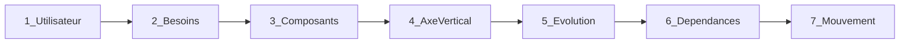
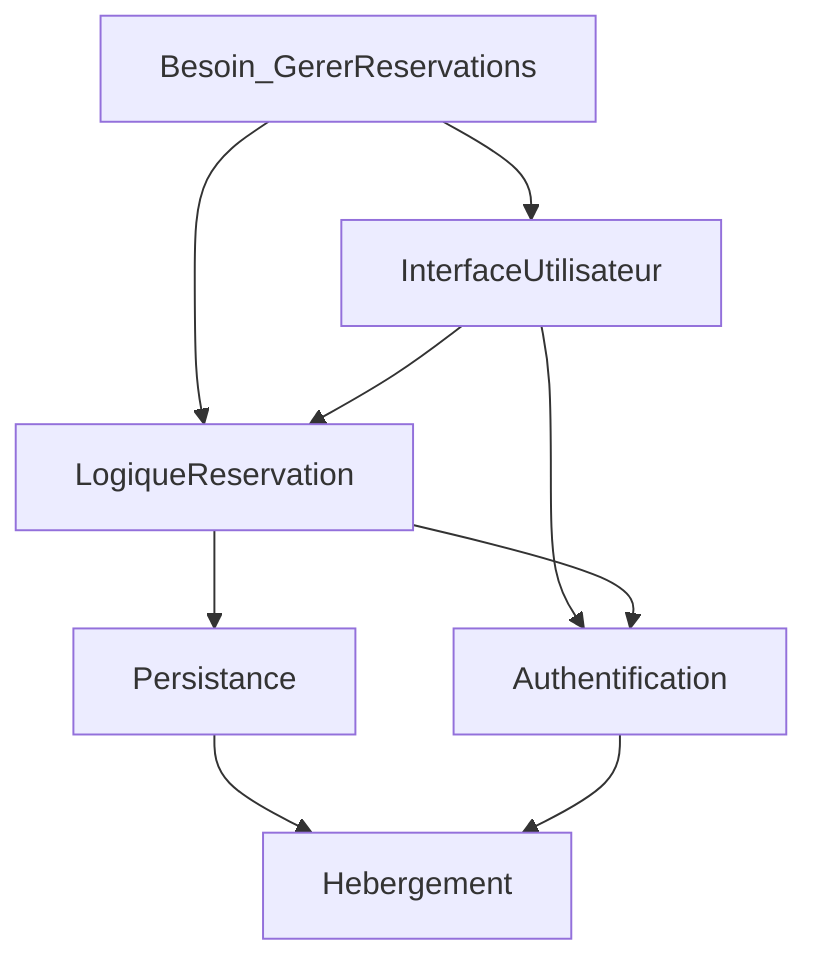

# Module 4 — Méthode de construction

**Durée estimée :** 60 minutes

## Objectifs

À la fin de ce module, vous saurez :

- Construire une Wardley Map en 7 étapes
- Appliquer les règles spécifiques aux applications informatiques
- Utiliser le template vierge fourni

## Exercice associé

→ [Exercice 2 — Cartographier des composants](exercices/ex02-cartographier-composants.md)

## Template

→ [Template Wardley Map vierge](templates/wardley-map-vierge.md)

## La méthode en 7 étapes



### Étape 1 — Identifier l'utilisateur

**Question :** Qui reçoit la valeur de mon application ?

- Choisissez **un** utilisateur principal
- Soyez précis : « PME du secteur retail » plutôt que « entreprises »
- Si vous avez plusieurs personas très différents, créez une map par persona

**Exemple :** « Gérant d'un restaurant indépendant »

### Étape 2 — Lister les besoins

**Question :** Quels problèmes mon utilisateur veut-il résoudre ?

- Exprimez en **verbes** : « Gérer les réservations », « Suivre le chiffre d'affaires »
- 3 à 7 besoins suffisent pour une première map
- Ne listez pas de fonctionnalités techniques

| À éviter | Correct |
|----------|---------|
| « Avoir une API REST » | « Synchroniser avec mon logiciel de caisse » |
| « Dashboard temps réel » | « Voir l'occupation de ma salle en direct » |

### Étape 3 — Décomposer en composants

**Question :** De quoi ai-je besoin pour satisfaire chaque besoin ?

Pour chaque besoin, listez les composants nécessaires. Voici une **checklist standard** pour une application informatique :

#### Composants métier (souvent custom)

- Logique métier principale
- Algorithmes / règles de calcul
- Workflows / processus
- Reporting / analytics métier

#### Composants applicatifs

- Interface utilisateur (web, mobile)
- API / points d'intégration
- Notifications (push, email, SMS)
- Recherche / filtrage

#### Composants techniques

- Authentification / autorisation
- Persistance des données
- Cache
- File de messages / événements
- Stockage de fichiers

#### Composants infrastructure

- Hébergement / compute
- Réseau / CDN
- Certificats / sécurité réseau
- CI/CD
- Monitoring / observabilité
- Sauvegarde / disaster recovery

**Règle d'or :** visez **10 à 20 composants** pour une première map. Si vous en avez plus de 25, regroupez.

### Étape 4 — Placer sur l'axe vertical

**Question :** Quel est le degré de visibilité de chaque composant pour l'utilisateur ?

| Position | Critère | Exemples |
|--------|---------|----------|
| **Haut** (sous les besoins) | L'utilisateur interagit directement ou en perçoit la valeur | Interface, résultats de calcul, recommandations |
| **Milieu** | L'utilisateur en bénéficie sans le voir | API, notifications, recherche |
| **Bas** | Totalement invisible pour l'utilisateur | Auth, BDD, hébergement, CI/CD |

Placez chaque composant sur l'axe vertical en fonction de sa **visibilité**, pas de son importance technique.

### Étape 5 — Positionner sur l'axe d'évolution

**Question :** À quel stade de maturité se trouve ce composant sur le marché ?

Pour chaque composant, demandez-vous :

1. **Existe-t-il des solutions packagées ?** → Product ou Commodity
2. **Faut-il une expertise sur mesure ?** → Custom
3. **Est-ce nouveau et peu compris ?** → Genesis

| Question | Genesis | Custom | Product | Commodity |
|----------|---------|--------|---------|-----------|
| Combien de fournisseurs ? | 0-1 | Quelques-uns | Beaucoup | Très nombreux |
| Puis-je l'acheter clé en main ? | Non | Partiellement | Oui | Oui, interchangeable |
| Ai-je besoin d'expertise rare ? | Oui | Oui | Non | Non |
| Le prix est-il standardisé ? | Non | Non | Oui | Oui, très bas |

**Astuce :** regardez ce que font vos concurrents. Si tous utilisent Stripe pour le paiement, c'est du Product minimum.

### Étape 6 — Tracer les dépendances

**Question :** Quels composants dépendent de quels autres ?

- Dessinez des flèches du **haut vers le bas**
- Un composant métier dépend souvent de composants techniques, qui dépendent d'infrastructure
- Évitez les dépendances circulaires (signe que la décomposition est incorrecte)



### Étape 7 — Analyser le mouvement

**Question :** Quels composants vont évoluer vers la droite ? Dans quel délai ?

Pour chaque composant, évaluez :

- **Stable** : pas de mouvement significatif prévu
- **Mouvement lent** (3-5 ans) : migration progressive vers Product
- **Mouvement rapide** (1-2 ans) : commoditisation imminente

Ajoutez des flèches `→` pour les composants en mouvement.

**Questions stratégiques à ce stade :**

- Construis-je quelque chose qui sera une commodité avant la fin du projet ?
- Un composant genesis va-t-il devenir product pendant que je le développe ?
- Où serai-je dans 2 ans si je ne change rien ?

## Règles pratiques pour les applications informatiques

### Règle 1 : Composant ≠ Technologie

| Composant (correct) | Technologie (implémentation) |
|---------------------|------------------------------|
| Persistance des données | PostgreSQL, MongoDB, DynamoDB |
| Interface utilisateur | React, Vue, Flutter |
| Authentification | Auth0, Keycloak, Firebase Auth |
| Hébergement | AWS, GCP, VPS OVH |

La map porte sur les **composants**. Le choix de technologie vient **après** la map, en fonction de la zone stratégique.

### Règle 2 : Un besoin, pas une feature

Reformulez chaque feature en besoin utilisateur :

```text
Feature : « Bouton d'export CSV »
Besoin  : « Exporter mes données pour les analyser dans Excel »
```

### Règle 3 : Regrouper avant de détailler

Première passe : 10-15 composants larges. Deuxième passe (optionnelle) : décomposer un composant critique.

### Règle 4 : La map est un snapshot

Elle représente un **instant T**. Datez-la. Refaites-la tous les 6-12 mois ou à chaque pivot stratégique.

### Règle 5 : Faites-la en équipe

La map gagne à être construite en atelier (2-4 personnes, 1-2 heures) avec des perspectives différentes : métier, technique, produit.

## Outils pour créer votre map

| Outil | Avantages | Inconvénients |
|-------|-----------|---------------|
| **Papier / tableau blanc** | Rapide, collaboratif, pas de contrainte | Pas de versionnage |
| **Mermaid** (markdown) | Versionnable, intégrable dans la doc | Limité visuellement |
| **[wardleymaps.com](https://www.wardleymaps.com/)** | Outil dédié, export | Courbe d'apprentissage |
| **draw.io / Excalidraw** | Flexible, collaboratif | Pas de sémantique Wardley native |
| **Figma / Miro** | Atelier remote, templates | Nécessite adaptation manuelle |

## Exemple complet : application de livraison de repas

### Étape 1 — Utilisateur

Restaurateur partenaire

### Étape 2 — Besoins

1. Recevoir des commandes en temps réel
2. Gérer mon menu et mes prix
3. Suivre mes revenus

### Étape 3-5 — Composants positionnés

| Composant | Vertical | Horizontal |
|-----------|----------|------------|
| Réception commandes temps réel | Haut | Custom |
| Gestion de menu | Haut | Product |
| Tableau de bord revenus | Haut | Product |
| Interface restaurateur | Haut | Product |
| Matching livreur-client | Milieu | Custom |
| Notifications push | Milieu | Product |
| Authentification | Bas | Product |
| Persistance | Bas | Commodity |
| Hébergement | Bas | Commodity |
| Paiement | Bas | Product |

### Étape 6-7 — Dépendances et mouvement

- Le matching livreur-client est le différenciateur (Custom) mais des acteurs comme Uber Eats ont des solutions Product → mouvement rapide
- Le paiement est Product (Stripe) → ne pas construire
- L'hébergement est Commodity → AWS/GCP sans réfléchir

## Résumé

1. **Utilisateur** → un acteur principal
2. **Besoins** → 3-7 besoins en langage métier
3. **Composants** → 10-20 capacités (pas des technos)
4. **Vertical** → visibilité pour l'utilisateur
5. **Horizontal** → maturité marché (genesis → commodity)
6. **Dépendances** → flèches du haut vers le bas
7. **Mouvement** → flèches vers la droite pour l'évolution anticipée

## Suite

→ [Exercice 2](exercices/ex02-cartographier-composants.md) puis [Module 5 — Décisions technologiques](05-decisions-technologiques.md)
