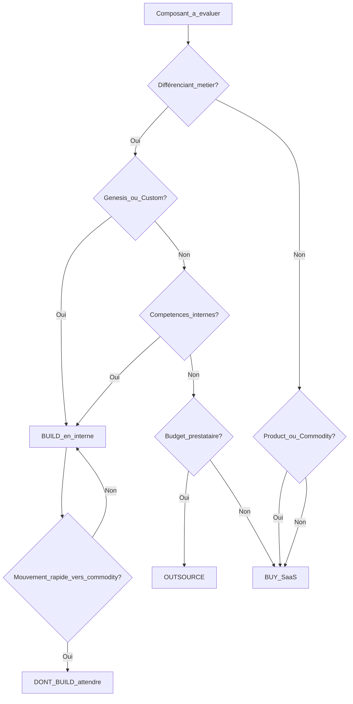

# Module 5 — Décisions technologiques

**Durée estimée :** 60 minutes

## Objectifs

À la fin de ce module, vous saurez :

- Relier la position sur la map à une décision build / buy / outsource
- Utiliser la grille de décision avec 7 critères
- Appliquer les patterns de ressources externes
- Éviter les pièges classiques de sur-développement

## Exercice associé

→ [Exercice 3 — Build / Buy / Outsource](exercices/ex03-build-buy-outsource.md)

## Template

→ [Grille de décision](templates/grille-decision.md)

## Les quatre décisions possibles

| Décision | Signification | Quand l'appliquer |
|----------|---------------|-------------------|
| **Build** (construire) | Développer en interne | Composant différenciant, genesis/custom haut, compétence clé |
| **Buy** (acheter) | Utiliser un SaaS, une librairie ou un produit packagé | Composant en phase Product ou Commodity |
| **Outsource** (externaliser) | Confier à un prestataire ou une équipe externe | Composant custom non différenciant, pic de charge, compétence absente en interne |
| **Don't build** (ne pas faire) | Reporter, simplifier ou supprimer le besoin | Composant qui va se commoditiser avant la fin du projet, ou besoin non validé |

## Cartographie zone → décision

```text
                    Genesis    Custom      Product      Commodity
                 ┌──────────┬───────────┬────────────┬────────────┐
    Besoins /    │          │           │            │            │
    Métier haut  │  BUILD   │  BUILD /  │   BUY      │   BUY      │
                 │  ★★★     │  ARBITRE  │            │            │
                 ├──────────┼───────────┼────────────┼────────────┤
    Technique    │  BUILD   │  ARBITRE  │   BUY      │   BUY      │
    bas          │          │  OUTSOURCE│            │   ★★★      │
                 └──────────┴───────────┴────────────┴────────────┘

★★★ = décision quasi automatique
ARBITRE = analyser avec la grille de décision
```

### Zone haut-gauche (Genesis / Custom, visible)

**Décision par défaut : BUILD**

- C'est votre avantage compétitif
- Personne d'autre ne le fait exactement comme vous en avez besoin
- Exemple : algorithme de matching propriétaire, workflow métier unique

**Attention :** vérifiez que le composant ne va pas se commoditiser rapidement (mouvement →).

### Zone milieu (Custom / Product)

**Décision : ARBITRER avec la grille**

C'est la zone la plus complexe. Exemples :

| Composant | Position | Décision typique | Justification |
|-----------|----------|------------------|---------------|
| API publique | Custom | Build (MVP) puis réévaluer | Différenciant à court terme, mais des API gateways existent |
| Moteur de recherche | Product | Buy (Algolia, Meilisearch) | Produits matures, pas de valeur à construire |
| Back-office admin | Custom | Outsource | Nécessaire mais pas différenciant |
| Chat en temps réel | Product | Buy (Stream, Pusher) | Produits éprouvés, SDK disponibles |

### Zone bas-droite (Product / Commodity, invisible)

**Décision par défaut : BUY**

- Ne jamais construire de l'hébergement, de l'auth, du CDN
- Exemples : AWS, Auth0, Cloudflare, SendGrid, Stripe

## La grille de décision

Pour chaque composant en zone d'arbitrage, évaluez ces 7 critères :

| # | Critère | Question | Score |
|---|---------|----------|-------|
| 1 | **Différenciation métier** | Ce composant est-il un avantage concurrentiel ? | Oui = Build / Non = Buy-Outsource |
| 2 | **Stade d'évolution** | Genesis/Custom ou Product/Commodity ? | Gauche = Build / Droite = Buy |
| 3 | **Coût total** | Build + maintenance vs abonnement SaaS vs prestataire ? | Comparer sur 3 ans |
| 4 | **Compétences internes** | L'équipe maîtrise-t-elle cette technologie ? | Oui = Build possible / Non = Buy-Outsource |
| 5 | **Risque de lock-in** | Peut-on changer de fournisseur facilement ? | Élevé = prudence / Faible = Buy OK |
| 6 | **Conformité / sécurité** | Données sensibles, RGPD, secteur régulé ? | Contrainte forte = Build ou fournisseur certifié |
| 7 | **Time-to-market** | Quel délai pour livrer ? | Urgent = Buy / Long = Build possible |

→ Utilisez le [template grille de décision](templates/grille-decision.md) pour chaque composant.

### Exemple d'application de la grille

**Composant : Système de notifications push pour une app mobile**

| Critère | Évaluation | Score |
|---------|------------|-------|
| Différenciation | Non — toutes les apps envoient des notifications | Buy |
| Évolution | Product (Firebase, OneSignal, AWS SNS) | Buy |
| Coût | Firebase gratuit jusqu'à un seuil, build = 2-3 semaines dev | Buy |
| Compétences | Équipe ne connaît pas les push natifs | Buy |
| Lock-in | Moyen (Firebase) — acceptable pour un MVP | Buy |
| Conformité | Pas de données sensibles dans les notifs | Buy |
| Time-to-market | Besoin pour le lancement dans 6 semaines | Buy |

**Décision : BUY** — utiliser Firebase Cloud Messaging ou OneSignal.

## Patterns de ressources externes

### Pattern 1 — Acheter un SaaS (Buy)

**Quand :** composant en phase Product ou Commodity.

| Composant | Solutions courantes | Stade |
|-----------|-------------------|-------|
| Authentification | Auth0, Firebase Auth, Keycloak (self-hosted) | Product |
| Paiement | Stripe, PayPal, Mollie | Product |
| Email transactionnel | SendGrid, Mailgun, AWS SES | Commodity |
| Recherche full-text | Algolia, Meilisearch, Elasticsearch (managé) | Product |
| Stockage fichiers | S3, Cloudinary, Uploadcare | Commodity |
| Monitoring | Datadog, Sentry, Grafana Cloud | Product |
| CI/CD | GitHub Actions, GitLab CI, CircleCI | Product-Commodity |

**Avantages :** time-to-market, maintenance déléguée, expertise incluse.
**Risques :** coût récurrent, dépendance fournisseur, personnalisation limitée.

### Pattern 2 — Construire en interne (Build)

**Quand :** composant différenciant en zone genesis/custom haut.

| Composant | Pourquoi construire |
|-----------|-------------------|
| Algorithme de pricing dynamique | Avantage concurrentiel unique |
| Moteur de recommandation métier | Cœur de la proposition de valeur |
| Workflow métier spécifique | Aucun produit du marché ne correspond |
| Logique de scoring propriétaire | Secret commercial |

**Avantages :** contrôle total, différenciation, pas de lock-in.
**Risques :** coût de développement et maintenance, détourne des ressources du cœur métier.

### Pattern 3 — Externaliser (Outsource)

**Quand :** composant custom mais **non différenciant**, ou besoin de compétences absentes en interne.

| Situation | Exemple | Pourquoi externaliser |
|-----------|---------|----------------------|
| Pic de charge temporaire | Refonte UI complète | L'équipe interne est sur le backend |
| Compétence absente | App mobile native (iOS/Android) | Équipe web uniquement |
| Composant nécessaire mais banal | Back-office CRUD admin | Pas de valeur ajoutée à le faire en interne |
| Prototype rapide | POC d'une feature genesis | Valider avant d'internaliser |

**Avantages :** flexibilité, accès à des compétences rares, coût variable.
**Risques :** qualité variable, perte de connaissance interne, coordination.

**Distinction Buy vs Outsource :**

- **Buy** = produit packagé existant (Stripe, Auth0)
- **Outsource** = quelqu'un construit **pour vous** un composant sur mesure

### Pattern 4 — Ne pas faire (Don't build)

**Quand :** le composant va se commoditiser avant la fin du projet, ou le besoin n'est pas validé.

| Situation | Action |
|-----------|--------|
| Besoin non validé par les utilisateurs | Reporter — ne pas construire |
| Composant en mouvement rapide vers commodity | Attendre qu'un produit mature apparaisse |
| Feature « nice to have » | Simplifier ou supprimer |
| Sur-ingénierie précoce | Commencer par le minimum viable |

**Exemple :** en 2023, construire son propre chatbot IA from scratch alors que des API (OpenAI, Anthropic) étaient déjà disponibles en Product.

## Arbre de décision simplifié



## Gérer le vendor lock-in

Le lock-in n'est pas toujours mauvais. L'important est d'en être **conscient** et de **mitiger** quand c'est critique.

| Niveau de lock-in | Exemple | Mitigation |
|-------------------|---------|------------|
| **Faible** | Hébergement cloud (containers) | Docker + Kubernetes = portable |
| **Moyen** | Auth0, Stripe | APIs standardisées, export données possible |
| **Élevé** | Firebase (suite complète), Salesforce | Accepter si le gain time-to-market le justifie |
| **Critique** | Base de données propriétaire | Éviter — utiliser des standards (SQL, S3) |

**Règle :** plus le composant est en bas-droite (commodity), plus le lock-in est acceptable car le coût de changement est faible.

## Erreurs de décision classiques

| Erreur | Exemple | Conséquence | Bonne pratique |
|--------|---------|-------------|----------------|
| **Not Invented Here** | Construire son propre système d'auth | 3 mois perdus, failles de sécurité | Buy (Auth0) |
| **Sur-ingénierie précoce** | Microservices dès le MVP | Complexité inutile | Monolithe d'abord, découper plus tard |
| **Ignorer le mouvement** | Construire un moteur de recherche en 2025 | Algolia/Meilisearch font déjà le job | Buy |
| **Outsource le cœur métier** | Faire développer l'algorithme clé à l'étranger | Perte de savoir-faire | Build en interne |
| **Buy du genesis** | Acheter un outil immature pour un besoin unique | Mauvais fit, dépendance | Build ou attendre |

## Résumé

- **Haut-gauche** → Build (différenciation)
- **Bas-droite** → Buy (commodité)
- **Milieu** → Arbitrer avec la grille de 7 critères
- **Outsource** → Custom non différenciant ou compétence absente
- **Don't build** → Besoin non validé ou commoditisation imminente
- Toujours évaluer le **mouvement** et le **lock-in**

## Suite

→ [Exercice 3](exercices/ex03-build-buy-outsource.md) puis [Module 6 — Atelier : votre application](06-atelier-votre-application.md)
