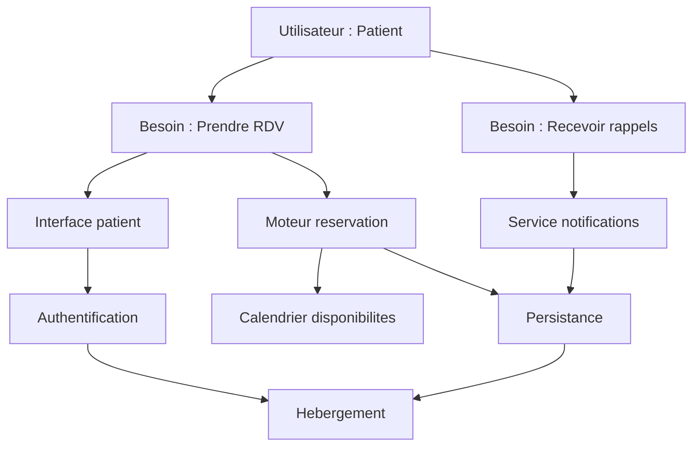

# Module 6 — Atelier : votre application

**Durée estimée :** 90 minutes

## Objectifs

À la fin de cet atelier, vous aurez :

- Une Wardley Map complète de votre application
- Un tableau de décisions build / buy / outsource
- Un plan d'action avec 3 décisions prioritaires

## Prérequis

- Avoir suivi les modules 1 à 5
- Avoir rempli la [fiche application](templates/fiche-application.md)

## Matériel nécessaire

- Fiche application remplie
- [Template Wardley Map vierge](templates/wardley-map-vierge.md)
- [Grille de décision](templates/grille-decision.md)
- Papier/tableau blanc ou outil numérique (Mermaid, draw.io, wardleymaps.com)

---

## Étape 1 — Valider l'utilisateur et les besoins (10 min)

### Questions-guides

Reprenons votre fiche application :

1. **Votre utilisateur principal est-il assez précis ?**
   - « Entreprises » est trop vague → « Directeur RH de PME (50-200 salariés) » est mieux
   - Si vous avez plusieurs personas très différents, choisissez-en **un** pour cette map

2. **Vos besoins sont-ils bien formulés ?**
   - Test : un non-technicien comprend-il chaque besoin ?
   - Test : utilisez-vous des verbes d'action (gérer, suivre, créer) et non des noms techniques (API, dashboard) ?

3. **Avez-vous 3 à 5 besoins, pas plus ?**
   - Si vous en avez plus de 7, regroupez les besoins similaires
   - Si vous en avez moins de 3, creusez : qu'est-ce que l'utilisateur fait concrètement ?

### Exemple de réponses types

| Fiche remplie | Qualité | Amélioration |
|---------------|---------|--------------|
| Utilisateur : « tout le monde » | Insuffisant | Choisir un persona principal |
| Besoin : « Avoir une API REST » | Incorrect (technique) | « Synchroniser mes données avec d'autres outils » |
| Besoin : « Gérer mes tâches » | Correct | — |
| 8 besoins listés | Trop | Regrouper en 4-5 besoins |

### Livrable étape 1

```text
Utilisateur : [votre réponse validée]
Besoin 1 : [validé]
Besoin 2 : [validé]
Besoin 3 : [validé]
```

---

## Étape 2 — Lister les composants (15 min)

### Questions-guides

Pour **chaque besoin**, demandez-vous : « De quoi ai-je besoin pour que l'utilisateur puisse faire ça ? »

1. **Quels composants métier sont nécessaires ?**
   - Logique de calcul, règles métier, workflows, algorithmes

2. **Quels composants applicatifs soutiennent l'expérience ?**
   - Interface, API, notifications, recherche, export

3. **Quels composants techniques sont indispensables ?**
   - Auth, persistance, cache, files de messages, stockage fichiers

4. **Quelle infrastructure est nécessaire ?**
   - Hébergement, CDN, CI/CD, monitoring, sauvegardes

### Checklist de composants types

Cochez ceux qui s'appliquent à votre application :

**Métier :**
- [ ] Logique métier principale
- [ ] Algorithme / moteur de calcul
- [ ] Workflow / processus
- [ ] Reporting / analytics métier

**Applicatif :**
- [ ] Interface utilisateur (web/mobile)
- [ ] API / intégrations
- [ ] Notifications (email, push, SMS)
- [ ] Recherche / filtrage
- [ ] Export / import de données

**Technique :**
- [ ] Authentification / autorisation
- [ ] Persistance des données
- [ ] Cache
- [ ] File de messages / événements
- [ ] Stockage de fichiers

**Infrastructure :**
- [ ] Hébergement
- [ ] CDN
- [ ] CI/CD
- [ ] Monitoring / observabilité
- [ ] Sauvegarde

### Règles

- Visez **10 à 20 composants**
- Nommez des **capacités**, pas des technologies (écrivez « Persistance », pas « PostgreSQL »)
- Un composant peut servir **plusieurs besoins**

### Exemple de réponses types

Pour une app de gestion de rendez-vous médicaux :

| Besoin | Composants identifiés |
|--------|----------------------|
| Prendre un rendez-vous | Calendrier de disponibilités, Moteur de réservation, Interface patient |
| Recevoir des rappels | Service de notifications, Templates de messages |
| Gérer mon agenda (médecin) | Interface praticien, Logique de gestion d'agenda |

### Livrable étape 2

| # | Composant | Besoin(s) associé(s) |
|---|-----------|----------------------|
| 1 | | |
| 2 | | |
| ... | | |

---

## Étape 3 — Positionner sur la map (20 min)

### Axe vertical — Visibilité

Pour chaque composant, posez la question : **« L'utilisateur voit-il ou perçoit-il directement ce composant ? »**

| Réponse | Position |
|---------|----------|
| Oui, il interagit directement | **Haut** (sous les besoins) |
| Il en bénéficie sans le voir | **Milieu** |
| Totalement invisible | **Bas** |

### Axe horizontal — Évolution

Pour chaque composant, posez ces questions dans l'ordre :

1. Existe-t-il des solutions packagées matures et interchangeables ? → **Commodity**
2. Existe-t-il des produits/SaaS reconnus sur le marché ? → **Product**
3. Faut-il une expertise sur mesure, peu de solutions existent ? → **Custom**
4. C'est nouveau, expérimental, peu de références ? → **Genesis**

### Questions-guides par composant

| Question | Si oui → | Si non → |
|----------|----------|----------|
| Mes concurrents utilisent-ils tous la même solution ? | Product/Commodity | Custom/Genesis |
| Puis-je l'acheter clé en main demain ? | Product/Commodity | Custom/Genesis |
| Est-ce ce qui me différencie ? | Custom/Genesis (gauche) | Product/Commodity (droite) |
| Ai-je besoin d'une expertise rare pour le faire ? | Genesis/Custom | Product/Commodity |

### Exemple de positionnement

Pour l'app de rendez-vous médicaux :

| Composant | Vertical | Horizontal | Justification |
|-----------|----------|------------|---------------|
| Moteur de réservation | Haut | Custom | Logique spécifique (créneaux, urgences, spécialités) |
| Calendrier de disponibilités | Haut | Product | Des composants existent (Cal.com, Calendly) |
| Interface patient | Haut | Product | Framework UI standard |
| Service de notifications | Milieu | Commodity | Email/SMS = utilitaires |
| Authentification | Bas | Product | Auth0, Firebase |
| Persistance | Bas | Commodity | Toute BDD managée |
| Hébergement | Bas | Commodity | Cloud standard |

### Livrable étape 3

Remplissez le [template Wardley Map vierge](templates/wardley-map-vierge.md) ou dessinez votre map.

---

## Étape 4 — Tracer les dépendances (10 min)

### Questions-guides

Pour chaque composant, demandez : **« De quoi ce composant a-t-il besoin pour fonctionner ? »**

Règles :
- Les flèches vont du **haut vers le bas**
- Un besoin dépend de composants, un composant dépend d'autres composants ou d'infra
- Pas de dépendances circulaires

### Exemple Mermaid



Adaptez ce schéma à **votre** application.

---

## Étape 5 — Marquer le mouvement (10 min)

### Questions-guides

Pour chaque composant, demandez :

1. **Ce composant va-t-il évoluer vers la droite ?** (genesis → custom → product → commodity)
2. **À quelle vitesse ?** Lent (3-5 ans), moyen (2-3 ans), rapide (1-2 ans)
3. **Quel impact sur ma stratégie ?**

### Signaux de mouvement rapide

- Des géants tech s'y mettent (Google, Microsoft, AWS lancent un service)
- Des startups bien financées proposent un SaaS dédié
- Le composant est lié à une technologie en hype (IA générative en 2024-2025)
- Vos concurrents migrent vers des solutions packagées

### Exemple

| Composant | Mouvement | Délai | Action |
|-----------|-----------|-------|--------|
| Chatbot IA | Genesis → Product | 1-2 ans | Investir maintenant, préparer le pivot |
| Calendrier | Product → Commodity | 3-5 ans | Buy dès maintenant, ne pas customiser |
| Moteur de réservation | Custom → Product | 2-3 ans | Construire mais rester lean |

### Livrable étape 5

Ajoutez les flèches `→` sur votre map pour les composants en mouvement.

---

## Étape 6 — Décisions build / buy / outsource (15 min)

### Questions-guides

Pour chaque composant en **zone d'arbitrage** (milieu de la map), remplissez la [grille de décision](templates/grille-decision.md).

Pour les composants en zone évidente :

| Zone | Décision automatique |
|------|---------------------|
| Haut-gauche (genesis/custom, visible) | **Build** |
| Bas-droite (product/commodity, invisible) | **Buy** |
| Custom non différenciant + équipe saturée | **Outsource** |
| Besoin non validé ou commoditisation imminente | **Don't build** |

### Tableau de décisions

| Composant | Zone | Décision | Solution | Priorité |
|-----------|------|----------|----------|----------|
| _[ex. Moteur métier]_ | _[Haut-Custom]_ | _[Build]_ | _[Interne]_ | _[P1]_ |
| _[ex. Auth]_ | _[Bas-Commodity]_ | _[Buy]_ | _[Auth0]_ | _[P1]_ |
| _[ex. Back-office]_ | _[Milieu-Custom]_ | _[Outsource]_ | _[Prestataire]_ | _[P3]_ |
| | | | | |

---

## Étape 7 — Plan d'action (10 min)

### Questions-guides

1. **Quelles sont les 3 décisions les plus urgentes ?** (composants bloquants pour le lancement)
2. **Quels composants ne devez-vous surtout pas construire ?** (erreurs coûteuses à éviter)
3. **Où allez-vous vous différencier dans 2 ans ?** (quand les composants actuels se seront commoditisés)

### Format du plan d'action

```text
PLAN D'ACTION — [Nom de votre application] — [Date]

═══ 3 DÉCISIONS PRIORITAIRES ═══

P1. [Composant] → [Décision] → [Solution] → [Délai]
    Justification : [...]
    Risque : [...]

P2. [Composant] → [Décision] → [Solution] → [Délai]
    Justification : [...]
    Risque : [...]

P3. [Composant] → [Décision] → [Solution] → [Délai]
    Justification : [...]
    Risque : [...]

═══ 3 COMPOSANTS À NE PAS CONSTRUIRE ═══

1. [Composant] — [Alternative] — [Économie estimée]
2. [Composant] — [Alternative] — [Économie estimée]
3. [Composant] — [Alternative] — [Économie estimée]

═══ DIFFÉRENCIATION FUTURE ═══

Quand [composant actuel] sera commoditisé, je me différencierai par :
→ [Nouveau différenciateur identifié]

═══ PROCHAINE RÉVISION ═══

Date : [dans 6 mois]
Déclencheur : [lancement MVP / levée de fonds / pivot]
```

### Exemple de réponses types

```text
PLAN D'ACTION — MediRDV — 24/06/2025

P1. Authentification → Buy → Auth0 → Semaine 1
    Justification : Commodity, bloquant pour tout le reste
    Risque : Coût à l'échelle (mitigation : abstraction AuthService)

P2. Moteur de réservation → Build → Interne → Mois 1-2
    Justification : Différenciateur (gestion multi-spécialités + urgences)
    Risque : Complexité (mitigation : MVP simple d'abord)

P3. Notifications → Buy → SendGrid + Firebase → Semaine 2
    Justification : Commodity, nécessaire pour les rappels
    Risque : Faible

À NE PAS CONSTRUIRE :
1. Auth — Auth0 — 3 semaines économisées
2. Hébergement — Railway — ops économisées
3. Paiement — Stripe — si monétisation — 4 semaines économisées

DIFFÉRENCIATION FUTURE :
Quand le calendrier sera commoditisé → se différencier par
l'intégration dossier médical et l'IA de triage.

RÉVISION : 24/12/2025 (après lancement MVP)
```

---

## Bilan de l'atelier

Vous devriez maintenant avoir :

- [x] Une Wardley Map complète (utilisateur, besoins, composants, dépendances, mouvement)
- [x] Un tableau de décisions pour chaque composant stratégique
- [x] Un plan d'action avec 3 priorités

## Prochaines étapes

1. **Partagez** votre map et vos décisions avec votre équipe
2. **Validez** les décisions P1 cette semaine
3. **Planifiez** une révision de la map dans 6 mois
4. Consultez les [cas pratiques](07-cas-pratiques.md) pour voir comment d'autres ont appliqué cette méthode

## Résumé

L'atelier suit la méthode en 7 étapes sur **votre** application réelle. La valeur n'est pas dans la map elle-même, mais dans les **conversations** et **décisions** qu'elle provoque.

## Suite

→ [Module 7 — Cas pratiques](07-cas-pratiques.md)
