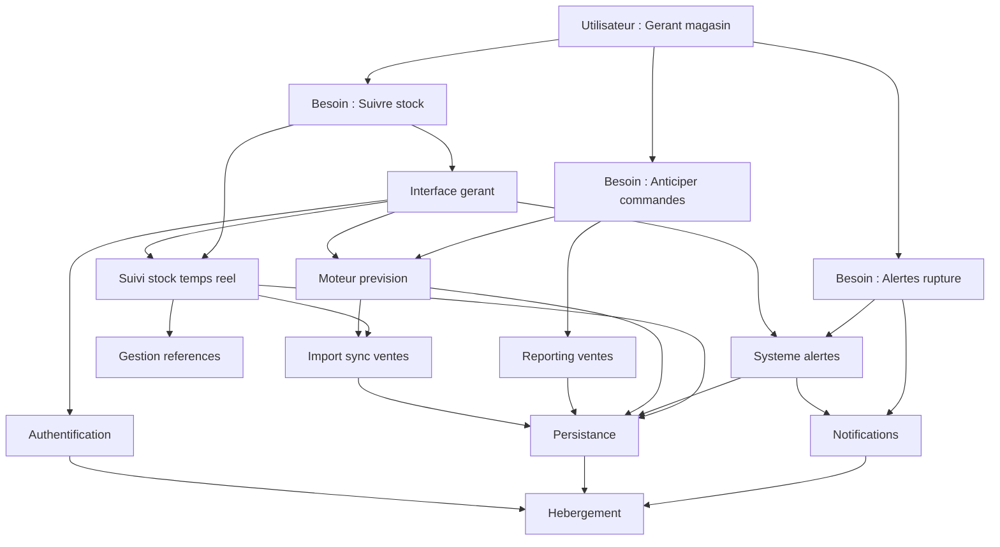

# Corrigé — Exercice 2 — Cartographier des composants

## Partie A — StockPro (corrigé)

### Étape 1-2 — Utilisateur et besoins

Les besoins fournis sont **corrects** :

| Besoin | Qualité | Commentaire |
|--------|---------|-------------|
| Suivre les niveaux de stock en temps réel | Correct | Verbe d'action, orienté utilisateur |
| Être alerté en cas de rupture | Correct | Besoin clair |
| Analyser les ventes pour anticiper | Correct | Pourrait être plus précis : « Anticiper mes besoins de réapprovisionnement » |

Pas d'amélioration nécessaire pour un premier exercice.

---

### Étape 3 — Composants (14 composants)

| # | Composant | Besoin(s) |
|---|-----------|-----------|
| 1 | Interface gérant (dashboard stock) | 1, 2, 3 |
| 2 | Moteur de suivi de stock en temps réel | 1 |
| 3 | Système d'alertes (seuils de rupture) | 2 |
| 4 | Moteur de prévision de commandes | 3 |
| 5 | Gestion des références produits | 1, 2, 3 |
| 6 | Import / sync des ventes | 1, 3 |
| 7 | Reporting / graphiques de ventes | 3 |
| 8 | Notifications (email, push) | 2 |
| 9 | Authentification | Tous |
| 10 | Persistance des données | Tous |
| 11 | API d'intégration (caisse, ERP) | 1, 6 |
| 12 | Hébergement | Tous |
| 13 | CI/CD | — |
| 14 | Monitoring | — |

---

### Étape 4-5 — Positionnement

| # | Composant | Vertical | Horizontal | Justification |
|---|-----------|----------|------------|---------------|
| 1 | Interface gérant | Haut | Product | Frameworks UI matures (React, Vue) |
| 2 | Suivi stock temps réel | Haut | Custom | Logique spécifique au retail, mais des patterns existent |
| 3 | Système d'alertes | Haut | Product | Fonctionnalité standard dans les outils de stock |
| 4 | Moteur de prévision | Haut | Custom | Algorithme différenciant (prévision de commandes) |
| 5 | Gestion références produits | Milieu | Product | CRUD standard |
| 6 | Import / sync ventes | Milieu | Product | Connecteurs standards (CSV, API caisse) |
| 7 | Reporting / graphiques | Milieu | Product | Chart.js, Metabase, etc. |
| 8 | Notifications | Milieu | Commodity | Email/push = utilitaires |
| 9 | Authentification | Bas | Commodity | Auth0, Firebase Auth |
| 10 | Persistance | Bas | Commodity | PostgreSQL managé, Supabase |
| 11 | API d'intégration | Milieu | Custom | Dépend des caisses/ERP ciblés |
| 12 | Hébergement | Bas | Commodity | Cloud standard |
| 13 | CI/CD | Bas | Product | GitHub Actions |
| 14 | Monitoring | Bas | Product | Sentry, Datadog |

---

### Étape 6 — Dépendances



---

### Étape 7 — Mouvement

| Composant | Mouvement | Vers | Délai | Impact |
|-----------|-----------|------|-------|--------|
| Moteur de prévision | Oui | Custom → Product | 2-3 ans | Des outils d'IA prédictive arrivent sur le marché retail. Investir maintenant mais rester lean |
| Suivi stock temps réel | Oui | Custom → Product | 3-5 ans | Lent, reste custom longtemps |
| API d'intégration | Oui | Custom → Product | 2-3 ans | Des connecteurs universels (Zapier, Make) progressent |
| Authentification | Non | Déjà Commodity | — | Buy, pas de discussion |
| Hébergement | Non | Déjà Commodity | — | Buy, pas de discussion |

---

### Réponses aux questions de réflexion

**1. Différenciateur :** le **moteur de prévision de commandes** (#4). C'est le composant en Custom le plus haut sur la map, directement lié au besoin « anticiper les commandes ». C'est ce qui distingue StockPro d'un simple tableau de stock.

**2. Buy automatique (bas-droite) :**
- Authentification → Auth0 / Firebase Auth
- Persistance → Supabase / RDS
- Hébergement → Railway / AWS
- Notifications → SendGrid + Firebase
- CI/CD → GitHub Actions

**3. Mouvement rapide :** le **moteur de prévision** (#4). L'IA prédictive pour le retail se standardise rapidement. StockPro doit :
- Construire un MVP de prévision maintenant (avantage court terme)
- Ne pas sur-investir (pas de data science lourde)
- Préparer un pivot de différenciation quand la prévision sera banale

---

### Map ASCII complète

```text
                    Genesis    Custom      Product      Commodity
                 ┌──────────┬───────────┬────────────┬────────────┐
  Utilisateur    │  [Gérant │           │            │            │
  magasin]       │  détail] │           │            │            │
                 ├──────────┼───────────┼────────────┼────────────┤
  Besoins        │          │[Suivre   │[Alertes  │            │
                 │          │ stock]   │ rupture]  │            │
                 │          │[Anticiper│            │            │
                 │          │ commandes│            │            │
                 ├──────────┼───────────┼────────────┼────────────┤
  Métier         │          │[Prévision│[Suivi    │[Alertes]  │
                 │          │ commandes│ stock]    │            │
                 │          │     →    │           │            │
                 ├──────────┼───────────┼────────────┼────────────┤
  Technique      │          │[API      │[Interface│[Notifs]   │
                 │          │ intégr.] │ gérant]   │            │
                 │          │     →    │[Reporting]│            │
                 ├──────────┼───────────┼────────────┼────────────┤
  Infra          │          │           │[CI/CD]    │[Auth]     │
                 │          │           │           │[BDD]      │
                 │          │           │           │[Héberge.] │
                 └──────────┴───────────┴────────────┴────────────┘
```

---

## Partie B — Guide de personnalisation

Ce guide vous aide à valider la map de **votre** application. Il ne fournit pas de corrigé unique (chaque application est différente), mais des **critères de validation**.

### Validation de l'utilisateur

| Votre réponse | Valide si... |
|---------------|-------------|
| Utilisateur principal | Un persona précis, pas « tout le monde » |
| Besoins (3-5) | Formulés en verbes, sans jargon technique |

### Validation des composants

Vérifiez que vous avez couvert ces catégories :

| Catégorie | Présent ? | Votre composant |
|-----------|-----------|-----------------|
| Interface utilisateur | ☐ | |
| Logique métier principale | ☐ | |
| Au moins 1 composant différenciant | ☐ | |
| Authentification | ☐ | |
| Persistance | ☐ | |
| Hébergement | ☐ | |

**Si une catégorie manque :** ajoutez le composant ou justifiez pourquoi il n'est pas nécessaire.

### Validation du positionnement

Pour chaque composant, posez-vous :

1. **Vertical :** « Mon utilisateur voit-il ce composant ? » → Oui = Haut, Non = Bas
2. **Horizontal :** « Puis-je l'acheter clé en main ? » → Oui = Product/Commodity, Non = Custom/Genesis

**Signaux d'alerte :**

| Signal | Problème probable | Action |
|--------|-------------------|--------|
| Tout est en Custom | Sur-estimation de la spécificité | Chercher des produits existants |
| Tout est en Commodity | Sous-estimation de la différenciation | Identifier le cœur métier |
| Rien en Genesis | Normal pour la plupart des apps | OK sauf si vous innovez vraiment |
| Plus de 25 composants | Map trop détaillée | Regrouper |

### Validation des dépendances

- [ ] Toutes les flèches vont du haut vers le bas
- [ ] Pas de dépendance circulaire
- [ ] Chaque besoin est connecté à au moins un composant
- [ ] L'infrastructure (bas) est le fondement de tout

### Validation du mouvement

- [ ] Au moins 1 composant a un mouvement anticipé
- [ ] Le différenciateur a un plan pour quand il se commoditisera
- [ ] Aucun composant en mouvement rapide n'a un investissement lourd prévu

### Comparaison avec StockPro

| Élément | StockPro | Votre app | Différence attendue |
|---------|----------|-----------|---------------------|
| Différenciateur | Moteur de prévision | _[Le vôtre]_ | Différent selon le domaine |
| Commodités | Auth, BDD, hébergement | _[Les vôtres]_ | Probablement similaires |
| Zone d'arbitrage | API intégration, suivi stock | _[La vôtre]_ | Spécifique à votre domaine |

### Prochaine étape

Une fois votre map validée :

1. Passez au [Module 5 — Décisions technologiques](../05-decisions-technologiques.md)
2. Remplissez la [grille de décision](../templates/grille-decision.md) pour les composants en zone d'arbitrage
3. Réalisez l'[atelier complet](../06-atelier-votre-application.md)

Si vous souhaitez un retour personnalisé sur votre map, partagez votre fiche application et votre map complétée.
