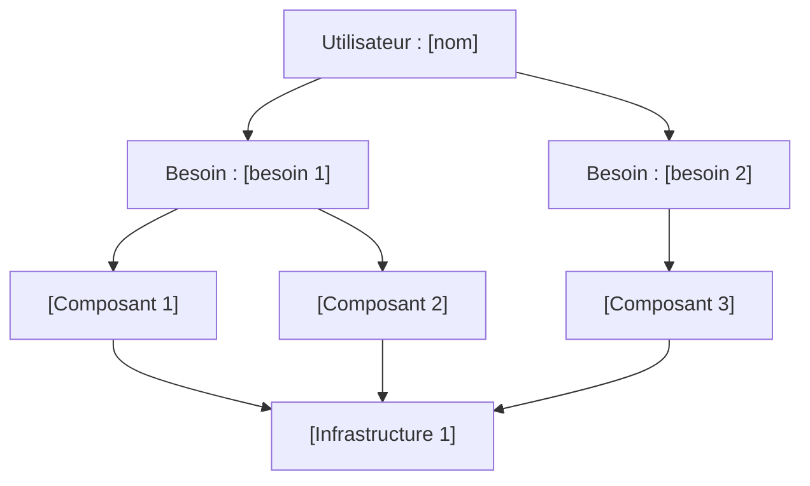

# Template — Wardley Map vierge

Copiez ce template et remplissez-le pour votre application.

**Date :** _[JJ/MM/AAAA]_  
**Application :** _[Nom]_  
**Utilisateur principal :** _[Qui]_

---

## Étape 1 — Utilisateur

```
Utilisateur : _______________________________________________
```

## Étape 2 — Besoins (3 à 7)

```
1. _______________________________________________
2. _______________________________________________
3. _______________________________________________
4. _______________________________________________
5. _______________________________________________
```

## Étape 3 à 5 — Composants positionnés

```text
                    Genesis    Custom      Product      Commodity
                 ┌──────────┬───────────┬────────────┬────────────┐
                 │          │           │            │            │
  Utilisateur    │          │           │            │            │
  [            ] │          │           │            │            │
                 │          │           │            │            │
                 ├──────────┼───────────┼────────────┼────────────┤
                 │          │           │            │            │
  Besoin 1       │          │[         ]│            │            │
  [            ] │          │           │            │            │
                 │          │           │            │            │
  Besoin 2       │          │           │[          ]│            │
  [            ] │          │           │            │            │
                 │          │           │            │            │
  Besoin 3       │          │           │            │            │
  [            ] │          │           │            │            │
                 ├──────────┼───────────┼────────────┼────────────┤
                 │          │           │            │            │
  Composant      │          │[         ]│            │            │
  métier 1       │          │           │            │            │
                 │          │           │            │            │
  Composant      │          │           │[          ]│            │
  métier 2       │          │           │            │            │
                 │          │           │            │            │
  Composant      │          │           │            │            │
  technique 1    │          │           │            │[           ]│
                 │          │           │            │            │
  Composant      │          │           │            │            │
  technique 2    │          │           │            │[           ]│
                 │          │           │            │            │
  Infra 1        │          │           │            │[           ]│
                 │          │           │            │            │
  Infra 2        │          │           │            │[           ]│
                 └──────────┴───────────┴────────────┴────────────┘
```

## Étape 6 — Dépendances (Mermaid)

Remplacez les noms entre crochets par vos composants :



## Étape 7 — Mouvement anticipé

Listez les composants qui vont évoluer vers la droite :

| Composant | Position actuelle | Mouvement vers | Délai estimé | Impact stratégique |
|-----------|-------------------|----------------|--------------|-------------------|
| _[Nom]_ | _[Custom]_ | _[Product]_ | _[2 ans]_ | _[Ne plus investir massivement]_ |
| | | | | |

## Liste des composants (tableau de travail)

| # | Composant | Besoin associé | Vertical (H/M/B) | Horizontal (G/C/P/Co) | Mouvement ? |
|---|-----------|----------------|-------------------|------------------------|-------------|
| 1 | | | | | |
| 2 | | | | | |
| 3 | | | | | |
| 4 | | | | | |
| 5 | | | | | |
| 6 | | | | | |
| 7 | | | | | |
| 8 | | | | | |
| 9 | | | | | |
| 10 | | | | | |

**Légende :** H = Haut, M = Milieu, B = Bas | G = Genesis, C = Custom, P = Product, Co = Commodity
