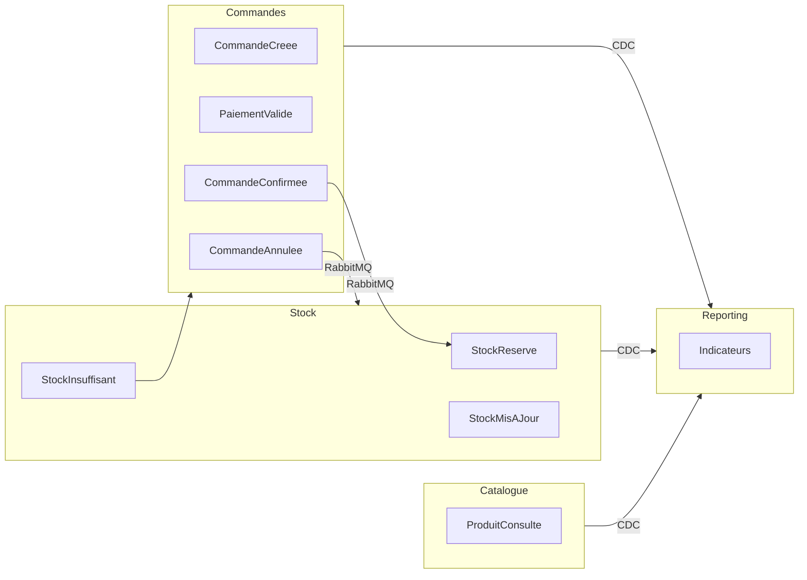

# Event Storming — Événements domaine

**Synergetic Blueprint** : étape 6 (EventStorming) + étape 7 (Event Modeling).

---

## Légende

| Symbole | Type |
|---------|------|
| 🟧 | Événement domaine |
| 🔵 | Commande / action utilisateur |
| 🟡 | Agrégat |
| 🟪 | Système externe |
| ➡️ | Flux temporel |

---

## Scénario 1 — Parcours client (Domain Storytelling)

```
🔵 Client consulte catalogue
    ➡️ 🟧 ProduitConsulte
        🟡 [Produit] (Catalogue)

🔵 Client ajoute au panier et valide
    ➡️ 🟧 CommandeCreee
        🟡 [Commande] (Commandes) — état : Créée

🔵 Client paie
    ➡️ 🟪 API Paiement externe
    ➡️ 🟧 PaiementValide
        🟡 [Commande] — état : Payée

    ➡️ 🟧 CommandeConfirmee
        🟡 [Commande] — état : Confirmée
        ➡️ (async) 🟧 StockReserve
            🟡 [NiveauStock] (Stock)
```

---

## Scénario 2 — Gestion stock (back-office)

```
🔵 Équipe interne consulte stock
    ➡️ 🟧 StockConsulte
        🟡 [NiveauStock]

🔵 Équipe interne ajuste quantité
    ➡️ 🟧 StockMisAJour
        🟡 [NiveauStock]

🔵 Réception CommandeConfirmee (async)
    ➡️ 🟧 StockReserve
        🟡 [NiveauStock] — quantité réservée décrémentée
```

---

## Scénario 3 — Reporting (lecture seule)

```
🟧 CommandeConfirmee ──(CDC)──➤ Reporting
🟧 StockMisAJour      ──(CDC)──➤ Reporting
🟧 ProduitConsulte    ──(CDC)──➤ Reporting (optionnel)

🔵 Équipe métier consulte indicateurs
    ➡️ Indicateurs affichés (Metabase)
```

---

## Catalogue des événements domaine

| Événement | Émetteur | Consommateur(s) | Déclencheur |
|-----------|----------|-----------------|-------------|
| `ProduitConsulte` | Catalogue | Reporting (CDC) | Consultation client |
| `CommandeCreee` | Commandes | — | Validation panier |
| `PaiementValide` | Commandes | — | Retour API paiement |
| `CommandeConfirmee` | Commandes | Stock (RabbitMQ) | Paiement validé |
| `StockReserve` | Stock | Reporting (CDC) | `CommandeConfirmee` |
| `StockMisAJour` | Stock | Reporting (CDC) | Ajustement manuel ou réservation |
| `CommandeAnnulee` | Commandes | Stock (RabbitMQ) | Annulation client/admin |
| `StockInsuffisant` | Stock | Commandes (alerte) | Réservation impossible |

---

## Event Modeling — Parcours API client (US-2)

| Étape | Action UI | API REST | Événement | État Commande |
|-------|-----------|----------|-----------|---------------|
| 1 | Ajout panier | `POST /commandes` | `CommandeCreee` | Créée |
| 2 | Paiement | `POST /commandes/{id}/paiement` | `PaiementValide` | Payée |
| 3 | Confirmation | (interne) | `CommandeConfirmee` | Confirmée |
| 4 | Réservation | (async via RabbitMQ) | `StockReserve` | — |

**Point clé** : les étapes 3 et 4 sont découplées. Le client reçoit la confirmation à l'étape 3 ; la réservation stock (étape 4) est asynchrone.

---

## Politiques (réactions aux événements)

| Politique | Quand | Alors |
|-----------|-------|-------|
| Réserver stock | `CommandeConfirmee` reçue | Créer `StockReserve` si quantité suffisante |
| Libérer stock | `CommandeAnnulee` reçue | Annuler la `Réservation` associée |
| Alerter stock insuffisant | Réservation impossible | Émettre `StockInsuffisant` vers Commandes |

---

## Bounded contexts et événements


