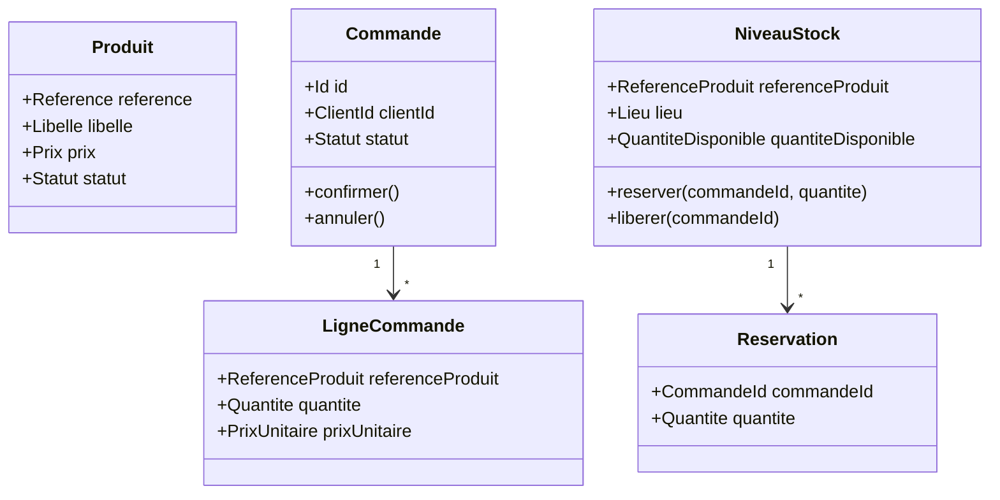

# Modèle de domaine — Design tactique

**Synergetic Blueprint** : étape 9 (agrégats, entités, value objects).

---

## Contexte Catalogue

### Agrégat : Produit

**Racine d'agrégat** : `Produit`

| Élément | Type | Description |
|---------|------|-------------|
| `reference` | Value Object | Identifiant unique du produit (ex. REF-1234) |
| `libelle` | Value Object | Nom affiché du produit |
| `description` | Value Object | Description textuelle |
| `prix` | Value Object | Montant strictement positif |
| `statut` | Value Object | ACTIF / INACTIF |

**Règles métier** :
- La `reference` est unique dans le contexte Catalogue
- Le `prix` doit être strictement positif
- Un Produit INACTIF n'est pas visible dans le catalogue client

**Événements** :
- `ProduitConsulte` (lors d'une consultation client)
- `ProduitCree`, `ProduitModifie` (back-office)

---

## Contexte Commandes

### Agrégat : Commande

**Racine d'agrégat** : `Commande`

| Élément | Type | Description |
|---------|------|-------------|
| `id` | Value Object | Identifiant unique (ex. CMD-5678) |
| `clientId` | Value Object | Référence du client |
| `lignes` | Entity (collection) | Liste de `LigneCommande` |
| `statut` | Value Object | CREE / EN_ATTENTE_PAIEMENT / PAYE / CONFIRME / ANNULE |
| `paiement` | Entity | Référence et statut du paiement externe |

**Entity : LigneCommande**

| Élément | Type | Description |
|---------|------|-------------|
| `referenceProduit` | Value Object | Référence produit (depuis Catalogue) |
| `quantite` | Value Object | Quantité commandée (> 0) |
| `prixUnitaire` | Value Object | Prix au moment de la commande |

**Règles métier** :
- Une Commande ne peut passer à CONFIRME qu'après Paiement validé
- La confirmation déclenche l'événement `CommandeConfirmee`
- L'annulation déclenche `CommandeAnnulee`

**Cycle de vie** :
```
CREE → EN_ATTENTE_PAIEMENT → PAYE → CONFIRME
                                    ↘ ANNULE
```

---

## Contexte Stock

### Agrégat : NiveauStock

**Racine d'agrégat** : `NiveauStock`

| Élément | Type | Description |
|---------|------|-------------|
| `referenceProduit` | Value Object | Référence produit |
| `lieu` | Value Object | Entrepôt ou magasin |
| `quantiteDisponible` | Value Object | Quantité en stock (≥ 0) |
| `quantiteReservee` | Value Object | Quantité réservée (≥ 0) |
| `reservations` | Entity (collection) | Liste de `Reservation` |

**Entity : Reservation**

| Élément | Type | Description |
|---------|------|-------------|
| `commandeId` | Value Object | Référence de la commande source |
| `quantite` | Value Object | Quantité réservée |
| `dateReservation` | Value Object | Horodatage |

**Règles métier** :
- `quantiteDisponible` ne peut pas être négative
- Une `Reservation` est créée à la réception de `CommandeConfirmee`
- Si stock insuffisant : émettre `StockInsuffisant`
- L'annulation d'une commande libère la réservation associée

---

## Diagramme des agrégats



---

## Correspondance agrégats → user stories

| Agrégat | User story | Événement clé |
|---------|------------|---------------|
| Produit | US-1 | `ProduitConsulte` |
| Commande | US-2 | `CommandeConfirmee` |
| NiveauStock | US-3 | `StockReserve` |
| — (Reporting) | US-4 | Lecture CDC (pas d'agrégat) |
