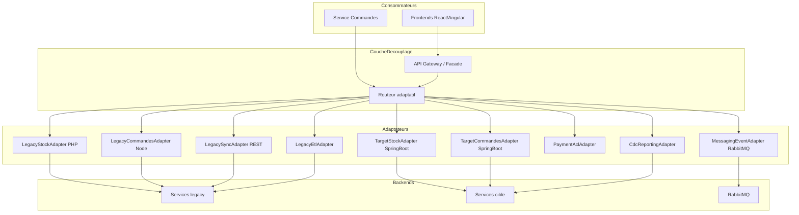
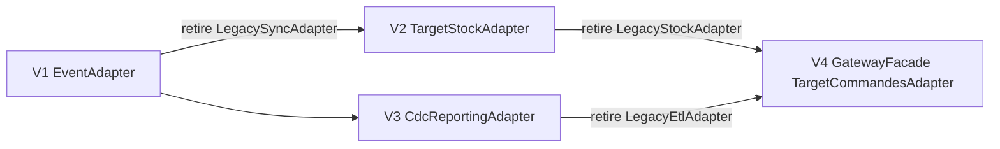

# Plan d'intégration des composants

Migration progressive du SI existant vers l'architecture cible, en 4 vagues alignées sur les priorités de l'audit. La migration s'appuie sur une **couche de découplage** (Strangler Fig Pattern + Anti-Corruption Layer) qui isole les consommateurs du legacy et route progressivement vers le système cible via des **adaptateurs interchangeables**.

**Contraintes** : système opérationnel pendant toute la migration ; pas de refonte big-bang ; appropriation progressive par les équipes.

---

## Architecture de migration — Couche de découplage

### Pourquoi une couche de découplage ?

Le SI legacy du Groupe Retail Sphère (Node.js, PHP, Python, base de données unique, appels REST synchrones) ne peut pas être remplacé d'un seul bloc sans interrompre la plateforme en production, sans exposer les frontends (React/Angular) à chaque changement interne, et sans multiplier les risques de régression à chaque bascule. Ces contraintes — système opérationnel pendant toute la migration, pas de refonte big-bang, appropriation progressive par les équipes — excluent une migration directe composant par composant (cf. [`08-justification-architecture.md`](08-justification-architecture.md)).

La couche de découplage matérialise le **Strangler Fig Pattern** : une façade stable (contrats REST et événements domaine) derrière laquelle coexistent les implémentations legacy et cible, avec bascule progressive via un routeur adaptatif. Les consommateurs ne voient que la façade ; le remplacement des backends se fait de manière transparente et réversible.

| Intérêt | Bénéfice | Lien audit / objectif |
|---------|----------|----------------------|
| **Isolation des consommateurs** | Frontends et services amont ne changent pas de contrat pendant la migration | Contrainte « SI opérationnel » |
| **Coexistence legacy / cible** | PHP Stock et Spring Boot Stock tournent en parallèle ; bascule par pourcentage | O3, principe évolutivité progressive |
| **Rollback local** | Reconfiguration du routeur, sans redéploiement global | Réduction du risque opérationnel |
| **Traduction des modèles (ACL)** | Chaque adaptateur isole les différences de modèle (Node.js, PHP, API Paiement) | O1, O4 — langage ubiquitaire |
| **Migration incrémentale par vague** | Chaque adaptateur legacy retiré après validation (V1 → V4) | P2 (async), P5 (CDC), P4 (BDD dédiées) |
| **Traçabilité** | Flux de migration visible dans le plan et le diagramme de déploiement | Pilotage et appropriation par les équipes |

Sans couche de découplage, chaque remplacement (par exemple PHP → Spring Boot) imposerait de modifier simultanément les appelants, les contrats et les données — une approche **big-bang par composant**, incompatible avec les contraintes du projet. La visualisation de cette coexistence (legacy en pointillé, cible en trait plein) est décrite dans [`10-architecture-deploiement.drawio`](10-architecture-deploiement.drawio).

### Principe

La couche de découplage expose des **contrats stables** (REST dans [`12-contrats-api.md`](12-contrats-api.md), événements domaine) et délègue l'exécution à des adaptateurs legacy ou cible via un **routeur adaptatif** (feature flags, pourcentage de trafic). Chaque adaptateur traduit entre le **modèle canonique** (aligné sur [`03-glossaire-domaine.md`](03-glossaire-domaine.md)) et le modèle legacy ou cible (ACL).

Un adaptateur legacy n'est retiré qu'après validation des critères de succès de la vague correspondante. Le rollback se fait par reconfiguration du routeur, sans impact sur les consommateurs (frontends, services amont).

### Catalogue des adaptateurs

| Adaptateur | Rôle | Legacy | Cible | Vague |
|------------|------|--------|-------|-------|
| `LegacySyncAdapter` | Appel REST synchrone Commandes → Stock | PHP Stock | — | V1 (puis retiré) |
| `MessagingEventAdapter` | Publication / consommation événements | — | RabbitMQ | V1 |
| `LegacyStockAdapter` | API stock PHP | PHP | — | V1–V2 |
| `TargetStockAdapter` | API stock Spring Boot | — | Spring Boot | V2 |
| `LegacyEtlAdapter` | Reporting batch Python | ETL | — | V3 (transition) |
| `CdcReportingAdapter` | Reporting CDC Debezium | — | Metabase | V3 |
| `LegacyCommandesAdapter` | API commandes Node.js | Node.js | — | V4 (puis retiré) |
| `TargetCommandesAdapter` | API commandes Spring Boot | — | Spring Boot | V4 |
| `PaymentAclAdapter` | Traduction modèle paiement externe | API tiers | API tiers | Existant → formalisé |
| `GatewayFacade` | Point d'entrée unique frontends | Direct | Spring Cloud Gateway | V4 |

---

## Vue d'ensemble des vagues

| Vague | Durée | Périmètre | Solution retenue | Objectif principal | Adaptateurs introduits | Adaptateurs basculés | Adaptateurs retirés |
|-------|-------|-----------|------------------|-------------------|------------------------|----------------------|---------------------|
| **V1** | 6-8 semaines | Flux Commandes → Stock | RabbitMQ + événements async | O1, O2 | `MessagingEventAdapter`, double route sync+async | Shadow async puis bascule async | `LegacySyncAdapter` |
| **V2** | 8-10 semaines | Service Stock | Migration Java Spring Boot | O3 | `TargetStockAdapter` | 10 % → 100 % vers cible | `LegacyStockAdapter` |
| **V3** | 4-6 semaines | Reporting | Debezium CDC + Metabase | O5 | `CdcReportingAdapter` | Lecture métier vers CDC | `LegacyEtlAdapter` (fin transition) |
| **V4** | 10-12 semaines | Données + Commandes + Gateway | BDD par service + API Gateway | O1, O4 | `GatewayFacade`, `TargetCommandesAdapter` | 100 % trafic via Gateway | `LegacyCommandesAdapter`, BDD unique |

**Durée totale estimée** : 7 à 9 mois

---

## Vague 1 — Messagerie asynchrone Commandes/Stock

### Périmètre

Introduction de la communication par événements entre Commandes (Node.js) et Stock (PHP) via la couche de découplage, en parallèle du flux synchrone existant. Les consommateurs ne changent pas de contrat.

### Adaptateurs concernés

| Adaptateur | Phase | Rôle |
|------------|-------|------|
| `LegacySyncAdapter` | Actif → retiré | Route REST synchrone Commandes → Stock (existant) |
| `MessagingEventAdapter` | Introduit → actif | Publication `CommandeConfirmee`, consommation côté Stock |

### Actions détaillées

| # | Action | Responsable | Durée |
|---|--------|-------------|-------|
| 1.1 | Déployer RabbitMQ (container Docker) | Ops | 1 sem. |
| 1.2 | Définir schémas événements (`CommandeConfirmee`, `CommandeAnnulee`) | Archi / Dev | 1 sem. |
| 1.3 | Implémenter `MessagingEventAdapter` : publier `CommandeConfirmee` après paiement validé | Dev Commandes | 2 sem. |
| 1.4 | Implémenter consommateur dans `MessagingEventAdapter` côté Stock → créer réservation | Dev Stock | 2 sem. |
| 1.5 | Configurer routeur : double-écriture sync (`LegacySyncAdapter`) + async shadow (`MessagingEventAdapter`) | Dev / Archi | 1 sem. |
| 1.6 | Tests de charge : 500 commandes simultanées, mesurer latence | QA | 1 sem. |
| 1.7 | Bascule routeur : désactiver `LegacySyncAdapter`, conserver uniquement `MessagingEventAdapter` | Ops / Dev | 1 sem. |

### Règles de routage

| Phase | Route sync (`LegacySyncAdapter`) | Route async (`MessagingEventAdapter`) |
|-------|----------------------------------|---------------------------------------|
| Shadow | 100 % (production) | 100 % (comparaison / réconciliation) |
| Bascule | 0 % (désactivé) | 100 % (production) |

### Solution retenue

- **RabbitMQ** (exchange topic `retail-sphere.events`)
- Événements : `CommandeConfirmee`, `CommandeAnnulee`, `StockReserve`, `StockInsuffisant`
- Pattern : double-écriture via routeur adaptatif, puis bascule et retrait de `LegacySyncAdapter`

### Critères de succès

- [ ] Latence confirmation commande stable en pic de charge (< 3 s au 95e percentile)
- [ ] 0 perte d'événements sur 7 jours de production
- [ ] Écarts stock/commandes < 1 % sur 24 h
- [ ] Consommateurs (frontends, API) inchangés — aucune modification de contrat

### Risques et mitigations

| Risque | Mitigation |
|--------|------------|
| Incohérence entre `LegacySyncAdapter` et `MessagingEventAdapter` | Journal d'événements + job de réconciliation batch quotidien |
| Perte de messages RabbitMQ | Acknowledgment + dead-letter queue |
| Régression fonctionnelle | Tests de non-régression automatisés avant bascule |
| Rollback complexe | Reconfiguration routeur uniquement (pas de redéploiement global) |

### Rollback

Reconfigurer le routeur : réactiver `LegacySyncAdapter` (100 % sync) ; désactiver la route production de `MessagingEventAdapter`.

---

## Vague 2 — Migration Service Stock vers Spring Boot

### Périmètre

Déploiement du service Stock cible (Spring Boot) derrière `TargetStockAdapter`. Bascule progressive du trafic depuis `LegacyStockAdapter` (PHP) via le routeur adaptatif.

### Adaptateurs concernés

| Adaptateur | Phase | Rôle |
|------------|-------|------|
| `LegacyStockAdapter` | Actif → retiré | API stock PHP (existant) |
| `TargetStockAdapter` | Introduit → actif | API stock Spring Boot (cible) |
| `MessagingEventAdapter` | Actif | Consumer RabbitMQ intégré au service cible |

### Actions détaillées

| # | Action | Responsable | Durée |
|---|--------|-------------|-------|
| 2.1 | Formation équipe Spring Boot / RabbitMQ / pattern adaptateur | RH / Archi | 2 sem. |
| 2.2 | Développer service Stock Spring Boot + `TargetStockAdapter` (parité fonctionnelle) | Dev | 4 sem. |
| 2.3 | Tests de parité : comparer réponses `LegacyStockAdapter` vs `TargetStockAdapter` | QA | 2 sem. |
| 2.4 | Routeur canary : 10 % trafic vers `TargetStockAdapter`, fallback `LegacyStockAdapter` | Ops | 1 sem. |
| 2.5 | Montée progressive routeur : 50 % → 100 % vers `TargetStockAdapter` | Ops | 1 sem. |
| 2.6 | Retrait `LegacyStockAdapter` ; décommissionner service Stock PHP | Ops | 1 sem. |

### Règles de routage

| Phase | `LegacyStockAdapter` | `TargetStockAdapter` |
|-------|----------------------|----------------------|
| Parité | 100 % | 0 % (tests shadow) |
| Canary | 90 % (fallback) | 10 % |
| Montée | 50 % → 0 % | 50 % → 100 % |
| Final | Retiré | 100 % |

### Solution retenue

- **Java Spring Boot** (aligné Catalogue)
- `TargetStockAdapter` expose `/api/stock` (contrats dans [`12-contrats-api.md`](12-contrats-api.md))
- Consumer RabbitMQ intégré dans le service cible

### Critères de succès

- [ ] Parité fonctionnelle validée (100 % des tests passent)
- [ ] `LegacyStockAdapter` retiré ; service PHP décommissionné
- [ ] Temps de réponse stock ≤ service PHP
- [ ] Consommateurs inchangés — routage transparent via couche de découplage

### Risques et mitigations

| Risque | Mitigation |
|--------|------------|
| Régression métier | Tests de parité automatisés ; bascule par pourcentage via routeur |
| Divergence modèle legacy / cible | ACL dans `TargetStockAdapter` ; modèle canonique partagé |
| Courbe d'apprentissage | Formation avant développement ; pair programming |

### Rollback

Reconfigurer le routeur : 100 % trafic vers `LegacyStockAdapter` ; `TargetStockAdapter` en mode shadow uniquement.

---

## Vague 3 — Modernisation du reporting

### Périmètre

Introduction de `CdcReportingAdapter` (Debezium + Metabase) en parallèle de `LegacyEtlAdapter` (ETL Python). Bascule progressive de la lecture métier vers le nouvel adaptateur.

### Adaptateurs concernés

| Adaptateur | Phase | Rôle |
|------------|-------|------|
| `LegacyEtlAdapter` | Actif → retiré | Reporting batch Python (existant) |
| `CdcReportingAdapter` | Introduit → actif | Reporting CDC Debezium → Metabase |

### Actions détaillées

| # | Action | Responsable | Durée |
|---|--------|-------------|-------|
| 3.1 | Déployer Debezium (container Docker) connecté à la BDD | Ops | 1 sem. |
| 3.2 | Implémenter `CdcReportingAdapter` : capture tables commandes et stock | Dev / Ops | 1 sem. |
| 3.3 | Déployer Metabase ; créer tableaux de bord initiaux via `CdcReportingAdapter` | Dev / Métier | 2 sem. |
| 3.4 | Validation croisée `LegacyEtlAdapter` vs `CdcReportingAdapter` avec équipes métiers | Métier | 1 sem. |
| 3.5 | Bascule lecture métier vers `CdcReportingAdapter` ; retrait `LegacyEtlAdapter` | Ops | 1 sem. |

### Règles de routage

| Phase | `LegacyEtlAdapter` | `CdcReportingAdapter` |
|-------|----------------------|-----------------------|
| Parallèle | Production (référence) | Shadow (validation) |
| Validation | Comparaison croisée | Production métier |
| Final | Retiré | 100 % lecture reporting |

### Solution retenue

- **Debezium** (CDC) + **Metabase** (BI) via `CdcReportingAdapter`
- `LegacyEtlAdapter` conservé en parallèle pendant la phase de validation

### Critères de succès

- [ ] Indicateurs (CA, volumes commandes, stocks) avec fraîcheur < 15 minutes
- [ ] Aucun impact mesuré sur les performances transactionnelles
- [ ] Équipes métiers valident les tableaux de bord
- [ ] Transactions opérationnelles non impactées (lecture seule découplée)

### Risques et mitigations

| Risque | Mitigation |
|--------|------------|
| Charge CDC sur BDD | Monitoring ; capture ciblée (tables critiques uniquement) |
| Données incohérentes entre adaptateurs | Période de validation croisée ETL vs CDC avant bascule |
| Rollback reporting | Reconfigurer routeur vers `LegacyEtlAdapter` |

### Rollback

Reconfigurer le routeur : réactiver `LegacyEtlAdapter` comme source unique ; désactiver `CdcReportingAdapter`.

---

## Vague 4 — Découplage des données et API Gateway

### Périmètre

Finalisation de la couche de découplage : `GatewayFacade` devient le point d'entrée unique. Bascule progressive de `LegacyCommandesAdapter` (Node.js) vers `TargetCommandesAdapter` (Spring Boot). Extraction des BDD par service derrière les adaptateurs — consommateurs non impactés.

### Adaptateurs concernés

| Adaptateur | Phase | Rôle |
|------------|-------|------|
| `GatewayFacade` | Introduit → actif | Spring Cloud Gateway, point d'entrée unique |
| `LegacyCommandesAdapter` | Actif → retiré | API commandes Node.js (existant) |
| `TargetCommandesAdapter` | Introduit → actif | API commandes Spring Boot (cible) |
| `PaymentAclAdapter` | Formalisé | Traduction modèle paiement (existant, intégré à la couche) |

### Actions détaillées

| # | Action | Responsable | Durée |
|---|--------|-------------|-------|
| 4.1 | Extraire BDD Stock (données stock uniquement) derrière `TargetStockAdapter` | DBA / Dev | 3 sem. |
| 4.2 | Extraire BDD Commandes (données commandes uniquement) derrière adaptateurs Commandes | DBA / Dev | 3 sem. |
| 4.3 | Développer service Commandes Spring Boot + `TargetCommandesAdapter` | Dev | 4 sem. |
| 4.4 | Déployer `GatewayFacade` (Spring Cloud Gateway) avec routeur adaptatif intégré | Ops | 1 sem. |
| 4.5 | Rediriger frontends vers `GatewayFacade` ; bascule progressive Commandes (10 % → 100 %) | Dev Front / Ops | 1 sem. |
| 4.6 | Retrait `LegacyCommandesAdapter` ; décommissionner Node.js + BDD unique résiduelle | Ops | 1 sem. |

### Règles de routage

| Phase | `LegacyCommandesAdapter` | `TargetCommandesAdapter` | `GatewayFacade` |
|-------|--------------------------|--------------------------|-----------------|
| Pré-bascule | 100 % | Shadow (parité) | Déployé, trafic partiel |
| Bascule | 50 % → 0 % | 50 % → 100 % | 100 % trafic frontends |
| Final | Retiré | 100 % | Point d'entrée unique |

### Solution retenue

- **PostgreSQL par service** (Catalogue, Commandes, Stock)
- **Spring Cloud Gateway** (`GatewayFacade`) comme façade de la couche de découplage
- **Service Commandes Spring Boot** via `TargetCommandesAdapter`

### Critères de succès

- [ ] 3 bases PostgreSQL indépendantes opérationnelles
- [ ] Évolutions localisées à un seul service (testé sur une évolution pilote)
- [ ] Pas de régression fonctionnelle sur les 4 user stories
- [ ] `GatewayFacade` route 100 % du trafic ; tous les adaptateurs legacy retirés
- [ ] Frontends et contrats API inchangés du point de vue consommateur

### Risques et mitigations

| Risque | Mitigation |
|--------|------------|
| Migration données complexe | Scripts de migration testés en pré-production ; rollback BDD |
| Régression Commandes | Tests end-to-end US-1 à US-4 avant bascule ; parité adaptateurs |
| Incohérence modèle Commandes legacy / cible | ACL dans `TargetCommandesAdapter` ; modèle canonique |

### Rollback

Reconfigurer `GatewayFacade` : routage direct vers `LegacyCommandesAdapter` ; restaurer BDD unique depuis sauvegarde si nécessaire.

---

## Synthèse des dépendances entre vagues

- V2 dépend de V1 (`MessagingEventAdapter` opérationnel côté Stock)
- V3 peut démarrer en parallèle de V2 (lecture seule, adaptateurs indépendants)
- V4 dépend de V2 (`TargetStockAdapter` stabilisé) et V3 (reporting validé)
- Chaque vague **accumule les adaptateurs cible** et **retire progressivement les adaptateurs legacy**

---

## Formation et accompagnement

| Vague | Formation | Public |
|-------|-----------|--------|
| V1 | RabbitMQ, événements domaine, pattern adaptateur / ACL, routeur adaptatif | Devs Commandes, Stock |
| V2 | Spring Boot avancé, parité adaptateurs legacy / cible | Devs Stock |
| V3 | Metabase, lecture CDC, validation croisée adaptateurs reporting | Équipes métiers, Ops |
| V4 | API Gateway, routage adaptatif, migration BDD derrière adaptateurs | Devs, DBA, Ops |
