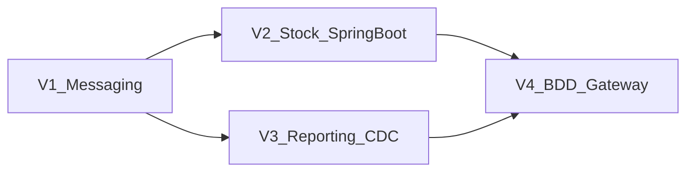

# Plan d'intégration des composants

Migration progressive du SI existant vers l'architecture cible, en 4 vagues alignées sur les priorités de l'audit.

**Contraintes** : système opérationnel pendant toute la migration ; pas de refonte big-bang ; appropriation progressive par les équipes.

---

## Vue d'ensemble des vagues

| Vague | Durée | Périmètre | Solution retenue | Objectif principal |
|-------|-------|-----------|------------------|-------------------|
| **V1** | 6-8 semaines | Flux Commandes → Stock | RabbitMQ + événements async | O1, O2 |
| **V2** | 8-10 semaines | Service Stock | Migration Java Spring Boot | O3 |
| **V3** | 4-6 semaines | Reporting | Debezium CDC + Metabase | O5 |
| **V4** | 10-12 semaines | Données + Commandes + Gateway | BDD par service + API Gateway | O1, O4 |

**Durée totale estimée** : 7 à 9 mois

---

## Vague 1 — Messagerie asynchrone Commandes/Stock

### Périmètre

Introduction de la communication par événements entre les services Commandes (Node.js) et Stock (PHP), en parallèle du flux synchrone existant.

### Actions détaillées

| # | Action | Responsable | Durée |
|---|--------|-------------|-------|
| 1.1 | Déployer RabbitMQ (container Docker) | Ops | 1 sem. |
| 1.2 | Définir schémas événements (`CommandeConfirmee`, `CommandeAnnulee`) | Archi / Dev | 1 sem. |
| 1.3 | Adapter Service Commandes : publier `CommandeConfirmee` après paiement validé | Dev Commandes | 2 sem. |
| 1.4 | Adapter Service Stock : consommateur `CommandeConfirmee` → créer réservation | Dev Stock | 2 sem. |
| 1.5 | Mettre en place double-écriture temporaire (sync + async) pour validation | Dev | 1 sem. |
| 1.6 | Tests de charge : 500 commandes simultanées, mesurer latence | QA | 1 sem. |
| 1.7 | Bascule : désactiver appel REST synchrone Commandes→Stock | Ops / Dev | 1 sem. |

### Solution retenue

- **RabbitMQ** (exchange topic `retail-sphere.events`)
- Événements : `CommandeConfirmee`, `CommandeAnnulee`, `StockReserve`, `StockInsuffisant`
- Pattern : double-écriture puis bascule

### Critères de succès

- [ ] Latence confirmation commande stable en pic de charge (< 3 s au 95e percentile)
- [ ] 0 perte d'événements sur 7 jours de production
- [ ] Écarts stock/commandes < 1 % sur 24 h

### Risques et mitigations

| Risque | Mitigation |
|--------|------------|
| Incohérence pendant double-écriture | Journal d'événements + job de réconciliation batch quotidien |
| Perte de messages RabbitMQ | Acknowledgment + dead-letter queue |
| Régression fonctionnelle | Tests de non-régression automatisés avant bascule |

### Rollback

Réactiver l'appel REST synchrone Commandes→Stock ; désactiver les consumers RabbitMQ.

---

## Vague 2 — Migration Service Stock vers Spring Boot

### Périmètre

Réécriture du Service Stock (PHP) en Java Spring Boot, aligné sur le Service Catalogue.

### Actions détaillées

| # | Action | Responsable | Durée |
|---|--------|-------------|-------|
| 2.1 | Formation équipe Spring Boot / RabbitMQ | RH / Archi | 2 sem. |
| 2.2 | Développer Service Stock Spring Boot (parité fonctionnelle) | Dev | 4 sem. |
| 2.3 | Tests de parité : comparer réponses PHP vs Spring Boot | QA | 2 sem. |
| 2.4 | Déploiement canary (10 % du trafic) | Ops | 1 sem. |
| 2.5 | Montée en charge progressive (50 % → 100 %) | Ops | 1 sem. |
| 2.6 | Décommissionner Service Stock PHP | Ops | 1 sem. |

### Solution retenue

- **Java Spring Boot** (aligné Catalogue)
- Consumer RabbitMQ intégré
- API REST `/api/stock` (contrats définis dans `12-contrats-api.md`)

### Critères de succès

- [ ] Parité fonctionnelle validée (100 % des tests passent)
- [ ] Service PHP décommissionné
- [ ] Temps de réponse stock ≤ service PHP

### Risques et mitigations

| Risque | Mitigation |
|--------|------------|
| Régression métier | Tests de parité automatisés ; feature flag |
| Courbe d'apprentissage | Formation avant développement ; pair programming |

### Rollback

Revenir au Service Stock PHP via feature flag / routage API Gateway.

---

## Vague 3 — Modernisation du reporting

### Périmètre

Introduction du CDC (Debezium) et de Metabase pour des indicateurs quasi temps réel, en complément de l'ETL Python existant.

### Actions détaillées

| # | Action | Responsable | Durée |
|---|--------|-------------|-------|
| 3.1 | Déployer Debezium (container Docker) connecté à la BDD | Ops | 1 sem. |
| 3.2 | Configurer capture sur tables commandes et stock | Dev / Ops | 1 sem. |
| 3.3 | Déployer Metabase ; créer tableaux de bord initiaux | Dev / Métier | 2 sem. |
| 3.4 | Valider fraîcheur des indicateurs avec équipes métiers | Métier | 1 sem. |
| 3.5 | Maintenir ETL Python en parallèle (transition) | Ops | Continu |

### Solution retenue

- **Debezium** (CDC) + **Metabase** (BI)
- ETL Python conservé en parallèle

### Critères de succès

- [ ] Indicateurs (CA, volumes commandes, stocks) avec fraîcheur < 15 minutes
- [ ] Aucun impact mesuré sur les performances transactionnelles
- [ ] Équipes métiers valident les tableaux de bord

### Risques et mitigations

| Risque | Mitigation |
|--------|------------|
| Charge CDC sur BDD | Monitoring ; capture ciblée (tables critiques uniquement) |
| Données incohérentes dans Metabase | Période de validation croisée ETL vs CDC |

### Rollback

Désactiver Debezium ; équipes métiers utilisent ETL batch existant.

---

## Vague 4 — Découplage des données et API Gateway

### Périmètre

Extraction des bases de données par service, migration Commandes Node.js → Spring Boot, mise en place de l'API Gateway.

### Actions détaillées

| # | Action | Responsable | Durée |
|---|--------|-------------|-------|
| 4.1 | Extraire BDD Stock (données stock uniquement) | DBA / Dev | 3 sem. |
| 4.2 | Extraire BDD Commandes (données commandes uniquement) | DBA / Dev | 3 sem. |
| 4.3 | Développer Service Commandes Spring Boot | Dev | 4 sem. |
| 4.4 | Déployer API Gateway (Spring Cloud Gateway) | Ops | 1 sem. |
| 4.5 | Rediriger frontends vers API Gateway | Dev Front | 1 sem. |
| 4.6 | Décommissionner Node.js Commandes + BDD unique résiduelle | Ops | 1 sem. |

### Solution retenue

- **PostgreSQL par service** (Catalogue, Commandes, Stock)
- **Spring Cloud Gateway** comme point d'entrée unique
- **Service Commandes Spring Boot**

### Critères de succès

- [ ] 3 bases PostgreSQL indépendantes opérationnelles
- [ ] Évolutions localisées à un seul service (testé sur une évolution pilote)
- [ ] Pas de régression fonctionnelle sur les 4 user stories
- [ ] API Gateway routage 100 % du trafic

### Risques et mitigations

| Risque | Mitigation |
|--------|------------|
| Migration données complexe | Scripts de migration testés en pré-production ; rollback BDD |
| Régression Commandes | Tests end-to-end US-1 à US-4 avant bascule |

### Rollback

Revenir au routage direct vers services ; BDD unique restaurée depuis sauvegarde.

---

## Synthèse des dépendances entre vagues

- V2 dépend de V1 (Stock consomme déjà les événements)
- V3 peut démarrer en parallèle de V2 (lecture seule)
- V4 dépend de V2 (Stock Spring Boot stabilisé)

---

## Formation et accompagnement

| Vague | Formation | Public |
|-------|-----------|--------|
| V1 | RabbitMQ, événements domaine | Devs Commandes, Stock |
| V2 | Spring Boot avancé | Devs Stock |
| V3 | Metabase, lecture CDC | Équipes métiers, Ops |
| V4 | API Gateway, migration BDD | Devs, DBA, Ops |
