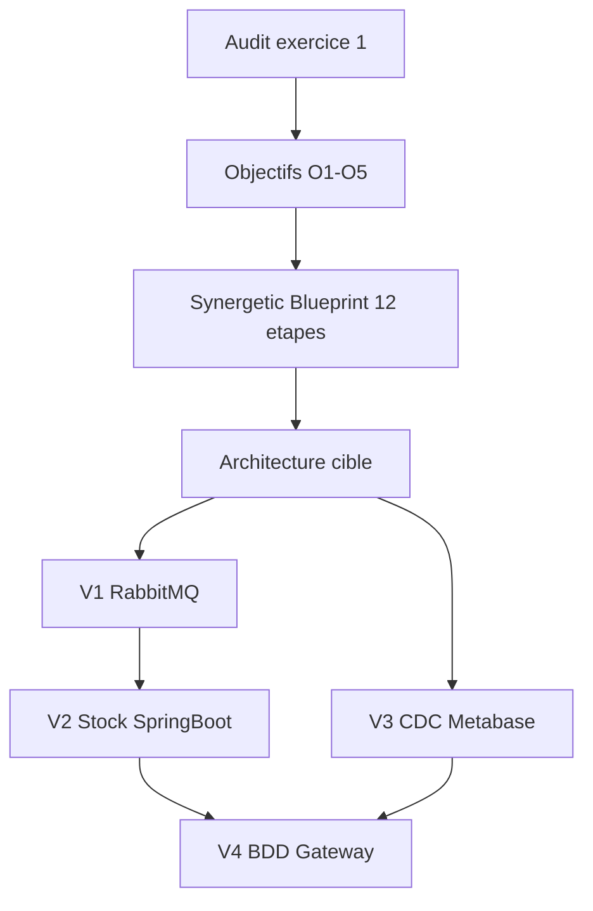

# Roadmap — Architecture cible Groupe Retail Sphère

Roadmap détaillée alignant le **Synergetic Blueprint** (12 étapes DDD), la demande [`besoin2.md`](../besoin2.md) et les solutions retenues issues de l'audit [`projet/livrables/`](../../projet/livrables/).

---

## Vue globale

| Phase | Blueprint | Besoin2 | Livrable | Durée rédaction | Durée exécution SI |
|-------|-----------|---------|----------|-----------------|-------------------|
| 0 | Amont idéation | Objectifs, principes | `01-objectifs-et-principes.md` | 0,5 j | — |
| 1 | Étapes 1-3 | — | `02-ideation-capabilities.md` | 0,5 j | — |
| 2 | Étapes 4-7 | User stories | `03` à `05` | 1,5 j | — |
| 3 | Étape 8 | — | `06-context-map.drawio` | 1 j | — |
| 4 | — | UML applicatif, justification | `07`, `08` | 1 j | — |
| 5 | — | Choix techno, UML déploiement | `09`, `10` | 1 j | — |
| 6 | Étapes 9-11 | — | `11`, `12` | 1 j | — |
| 7 | Étape 12 | Plan d'intégration | `13`, document final | 1,5 j | 7-9 mois |

---

## Phase 0 — Cadrage et objectifs

**Objectif** : Définir le pourquoi de l'architecture cible sans prescrire de techno.

| Action | Solution / output |
|--------|-------------------|
| Reformuler 5 problèmes audit | P1-P5 documentés |
| Définir 5 objectifs O1-O5 | Reliés 1:1 aux problèmes |
| Formaliser 4 principes | Séparation, découplage, évolutivité progressive, langage ubiquitaire |

**Artefact** : [`01-objectifs-et-principes.md`](01-objectifs-et-principes.md)

---

## Phase 1 — Idéation stratégique (Blueprint 1-3)

**Objectif** : Identifier et prioriser les capabilities métier.

| Action | Solution / output |
|--------|-------------------|
| Définir North Star | « Plateforme retail omnicanale fiable, évolutive et maintenable » |
| Identifier 5 capabilities | Catalogue, Commandes, Stock, Reporting, Paiement |
| Prioriser | Commandes + Stock en priorité 1 |
| Esquisser bounded contexts | 5 contextes candidats |

**Artefact** : [`02-ideation-capabilities.md`](02-ideation-capabilities.md)

---

## Phase 2 — Exigences (Blueprint 4-7)

**Objectif** : Formaliser les besoins en user stories et événements domaine.

| Action | Solution / output |
|--------|-------------------|
| Domain Storytelling | 3 scénarios (client, stock, reporting) |
| Visual Glossary | 7 termes ubiquitaires |
| EventStorming | 8 événements domaine |
| User stories | 4 US avec critères d'acceptation |
| Event Modeling | Parcours API US-2 découplé async |

**Artefacts** : [`03-glossaire-domaine.md`](03-glossaire-domaine.md), [`04-user-stories.md`](04-user-stories.md), [`05-event-storming.md`](05-event-storming.md)

---

## Phase 3 — Solution Design (Blueprint 8)

**Objectif** : Définir les relations entre bounded contexts et patterns d'intégration.

| Action | Solution retenue |
|--------|------------------|
| Context Map | 5 contextes + relations DDD |
| Commandes → Stock | Customer-Supplier + RabbitMQ |
| Commandes → Paiement | Anti-Corruption Layer |
| Reporting → domaines | Published Language + CDC |

**Artefact** : [`06-context-map.drawio`](06-context-map.drawio)

---

## Phase 4 — Architecture applicative

**Objectif** : Modéliser l'architecture cible et justifier les choix structurels.

| Action | Solution retenue |
|--------|------------------|
| UML composants | 3 couches + bus événementiel + 3 BDD |
| Microservices vs monolithe | **Microservices par bounded context** (progressif) |
| MVC/API front | **React/Angular + API Gateway** (conservés) |

**Artefacts** : [`07-architecture-applicative.drawio`](07-architecture-applicative.drawio), [`08-justification-architecture.md`](08-justification-architecture.md)

---

## Phase 5 — Architecture technologique

**Objectif** : Sélectionner et justifier la stack cible.

| Composant | Solution retenue | Objectif |
|-----------|------------------|----------|
| Backend | Java Spring Boot | O3 |
| Messaging | RabbitMQ | O1, O2 |
| BDD | PostgreSQL × 3 | O1, O4 |
| Gateway | Spring Cloud Gateway | O4 |
| Reporting | Debezium + Metabase | O5 |
| Front | React + Angular (conservés) | Continuité |

**Artefacts** : [`09-choix-technologiques.md`](09-choix-technologiques.md), [`10-architecture-deploiement.drawio`](10-architecture-deploiement.drawio)

---

## Phase 6 — Design tactique (Blueprint 9-11)

**Objectif** : Spécifier le modèle de domaine et les contrats d'interface.

| Action | Solution / output |
|--------|-------------------|
| Agrégats | Produit, Commande, NiveauStock |
| API REST | 3 services documentés |
| Événements | 4 schémas RabbitMQ |
| Example Mapping | Croisé avec US-1 à US-4 |

**Artefacts** : [`11-modele-domaine.md`](11-modele-domaine.md), [`12-contrats-api.md`](12-contrats-api.md)

---

## Phase 7 — Plan d'intégration et synthèse (Blueprint 12)

**Objectif** : Planifier la migration progressive et assembler le document final.

### Vagues d'exécution SI

| Vague | Durée | Solution | Actions clés |
|-------|-------|----------|--------------|
| **V1** | 6-8 sem. | RabbitMQ | Déployer broker ; publier/consommer événements ; tests charge ; bascule |
| **V2** | 8-10 sem. | Stock Spring Boot | Réécrire service ; parité PHP ; canary ; décommission PHP |
| **V3** | 4-6 sem. | Debezium + Metabase | CDC ; tableaux de bord ; validation métier |
| **V4** | 10-12 sem. | BDD/service + Gateway | Extraire BDD ; migrer Commandes ; API Gateway |

**Artefacts** : [`13-plan-integration.md`](13-plan-integration.md), [`document-architecture-cible.md`](document-architecture-cible.md)

---

## Calendrier synthétique

### Rédaction des artefacts (conception)

| Semaine | Phases | Livrables |
|---------|--------|-----------|
| S1 | 0, 1, début 2 | 01, 02, 03 |
| S2 | 2, 3 | 04, 05, 06 |
| S3 | 4, 5 | 07, 08, 09, 10 |
| S4 | 6, 7 | 11, 12, 13, document final |

### Exécution migration SI

| Mois | Vague | Jalon |
|------|-------|-------|
| M1-M2 | V1 | Messaging async opérationnel |
| M3-M4 | V2 | Stock Spring Boot en production |
| M5 | V3 | Reporting CDC opérationnel |
| M6-M9 | V4 | BDD découplées + API Gateway |

---

## Traçabilité complète

---

## Checklist de complétion

- [x] Objectifs reliés aux problèmes audit
- [x] 4 user stories avec critères d'acceptation
- [x] Chaque choix techno justifié par un objectif
- [x] Diagrammes UML (composants + déploiement)
- [x] Justification microservices vs monolithe
- [x] Plan d'intégration en 4 vagues progressives
- [x] Traçabilité Synergetic Blueprint → artefacts
- [x] Cohérence avec l'audit exercice 1
